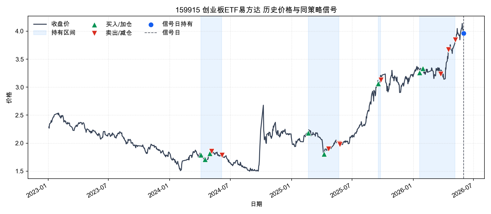
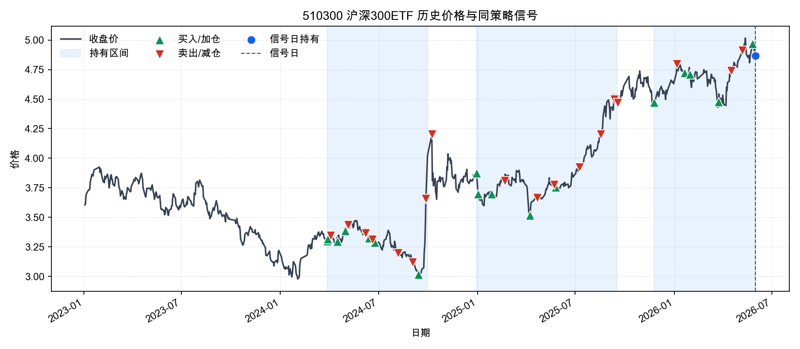
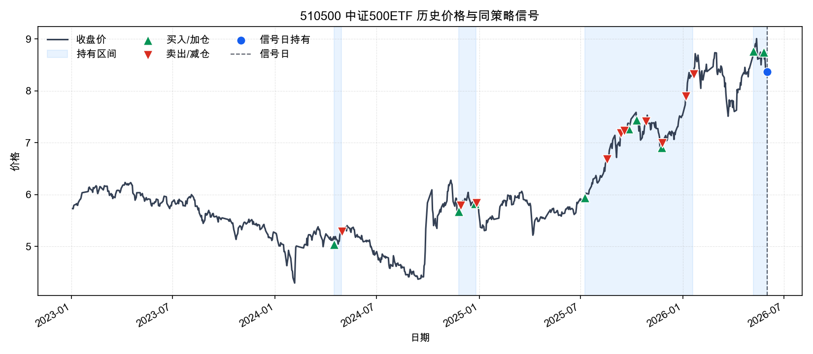
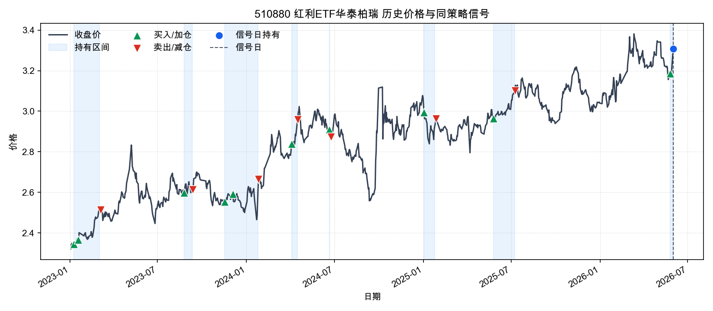
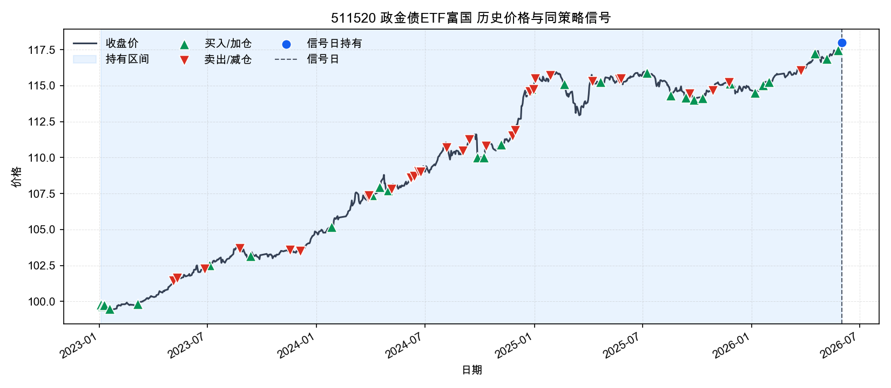
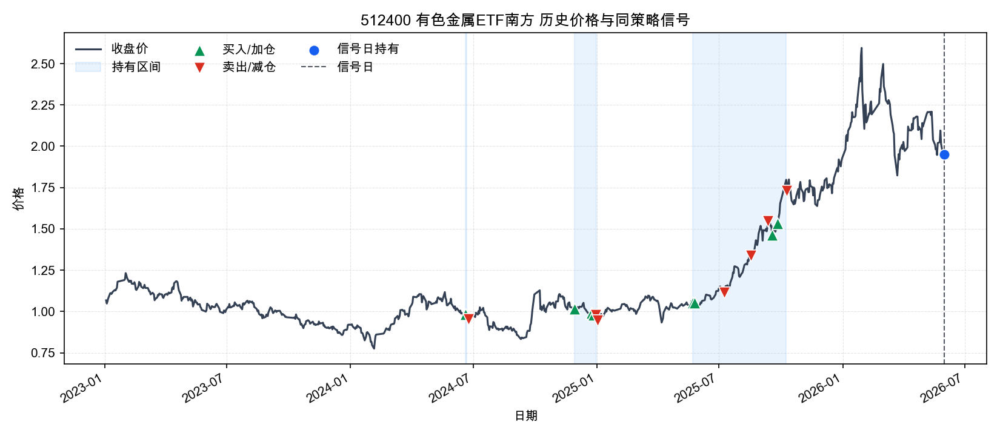
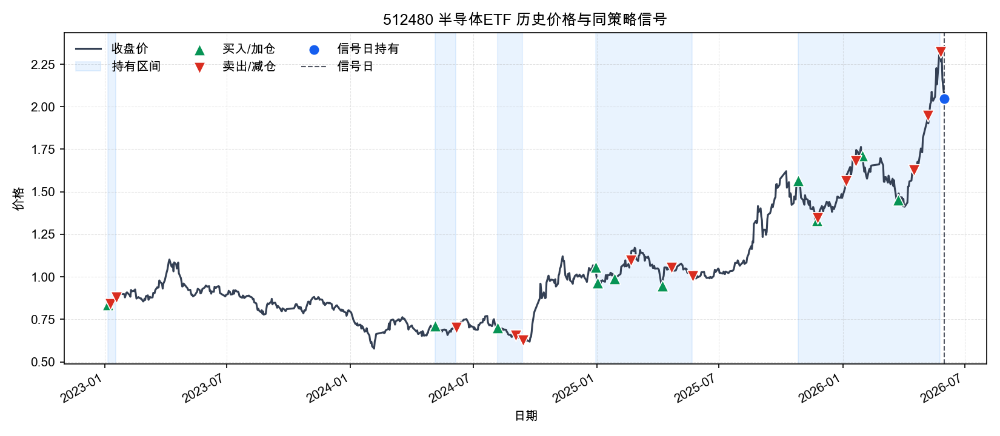
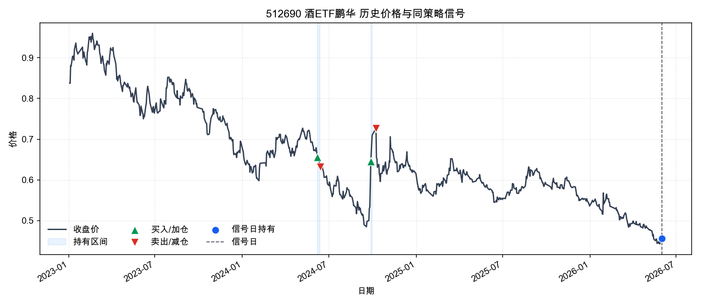
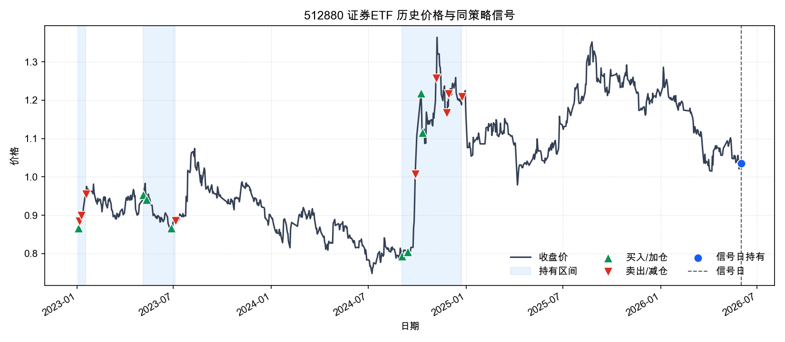
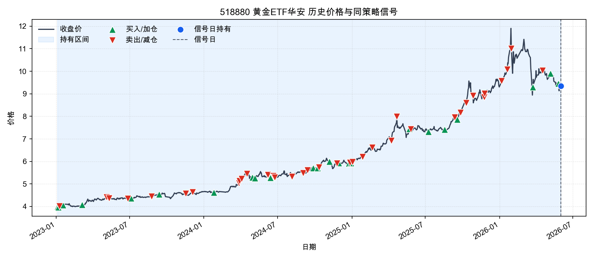

# 下一交易日策略建议报告

- 信号日: 2026-06-01
- 执行日: 2026-06-02（估算）
- 策略: `strategies/stable_model_event_driven_rotation.py`
- 执行原则: 信号日收盘后生成目标仓位，下一交易日开盘执行。

## 1. 总结结论

次日开盘无需主动调仓，维持当前策略目标仓位。

- 预计换手率: 0.00%
- 估算交易成本: 0.00
- 历史外推6个月收益预期: 8.54%
- 历史外推12个月收益预期: 17.80%
- 历史最大回撤/压力回撤: -5.53% / -8.30%

## 2. 次日交易执行方案

| 代码 | 名称 | 动作 | 当前权重 | 目标权重 | 变化 | 估算金额 | 参考收盘价 | 估算份额 | 原因 |
| --- | --- | --- | --- | --- | --- | --- | --- | --- | --- |
| 510300 | 沪深300ETF | 持有 | 9.91% | 9.91% | +0.00% | +0.00 | 4.8680 | 0 | 继续持有，未触发交易事件: win=94.06%, payoff=96.25%, 60日动量=4.06%, 综合评分=0.959 |
| 510500 | 中证500ETF | 持有 | 9.58% | 9.58% | +0.00% | +0.00 | 8.3700 | 0 | 继续持有，未触发交易事件: win=62.57%, payoff=61.21%, 60日动量=-0.06%, 综合评分=0.619 |
| 510880 | 红利ETF华泰柏瑞 | 持有 | 10.41% | 10.41% | +0.00% | +0.00 | 3.3070 | 0 | 继续持有，未触发交易事件: win=85.66%, payoff=60.39%, 60日动量=-1.78%, 综合评分=0.739 |
| 511520 | 政金债ETF富国 | 持有 | 57.30% | 57.30% | +0.00% | +0.00 | 118.0070 | 0 | 事件驱动风险预算: 股票ETF实际目标=30.00%，剩余仓位配置政金债/黄金；每日收盘监控，只有机会或风险事件触发交易。 |
| 518880 | 黄金ETF华安 | 持有 | 12.80% | 12.80% | +0.00% | +0.00 | 9.3440 | 0 | 事件驱动风险预算: 股票ETF实际目标=30.00%，剩余仓位配置政金债/黄金；每日收盘监控，只有机会或风险事件触发交易。 |

说明: 金额和份额按报告资金规模估算，实际下单时应使用次日开盘可成交价格和账户真实持仓校正。

## 3. 模型信号与调仓理由

| 代码 | 名称 | 评分 | 策略解释 |
| --- | --- | --- | --- |
| 511520 | 政金债ETF富国 | 2.0000 | 事件驱动风险预算: 股票ETF实际目标=30.00%，剩余仓位配置政金债/黄金；每日收盘监控，只有机会或风险事件触发交易。 |
| 518880 | 黄金ETF华安 | 1.9000 | 事件驱动风险预算: 股票ETF实际目标=30.00%，剩余仓位配置政金债/黄金；每日收盘监控，只有机会或风险事件触发交易。 |
| 510300 | 沪深300ETF | 0.9585 | 继续持有，未触发交易事件: win=94.06%, payoff=96.25%, 60日动量=4.06%, 综合评分=0.959 |
| 159915 | 创业板ETF易方达 | 0.8063 | 候选机会，仅监控未交易: win=79.02%, payoff=72.06%, 60日动量=23.68%, 综合评分=0.806 |
| 510880 | 红利ETF华泰柏瑞 | 0.7393 | 继续持有，未触发交易事件: win=85.66%, payoff=60.39%, 60日动量=-1.78%, 综合评分=0.739 |
| 510500 | 中证500ETF | 0.6195 | 继续持有，未触发交易事件: win=62.57%, payoff=61.21%, 60日动量=-0.06%, 综合评分=0.619 |

## 4. 大盘与ETF交易状态

- ETF池上涨比例: 30.00%
- ETF池平均日收益: -0.76%
- 基准 510300 沪深300ETF: 1日/20日/60日收益 -1.12% / 0.97% / 4.06%
- 基准近120日回撤: -2.97%

| 代码 | 名称 | 收盘 | 1日 | 20日 | 60日 | 成交额分位 | 份额20日变化 | 折溢价 |
| --- | --- | --- | --- | --- | --- | --- | --- | --- |
| 159915 | 创业板ETF易方达 | 3.9640 | -2.20% | 7.31% | 23.68% | 75.40% | 10.14% | 0.00% |
| 510300 | 沪深300ETF | 4.8680 | -1.12% | 0.97% | 4.06% | 19.44% | 52.27% | 0.00% |
| 510500 | 中证500ETF | 8.3700 | -0.86% | -0.62% | -0.06% | 69.44% | 31.78% | 0.00% |
| 510880 | 红利ETF华泰柏瑞 | 3.3070 | 3.15% | -1.20% | -1.78% | 99.21% | 10.78% | 0.00% |
| 511520 | 政金债ETF富国 | 118.0070 | 0.08% | 0.85% | 1.90% | 2.38% | -8.01% | 0.00% |
| 512400 | 有色金属ETF南方 | 1.9490 | -0.81% | -8.93% | -17.49% | 48.02% | -4.97% | 0.00% |
| 512480 | 半导体ETF | 2.0460 | -5.28% | 18.13% | 31.24% | 89.29% | 17.47% | 0.00% |
| 512690 | 酒ETF鹏华 | 0.4560 | -0.22% | -6.37% | -11.46% | 44.44% | 22.82% | 0.00% |
| 512880 | 证券ETF | 1.0350 | 0.19% | -3.81% | -9.53% | 17.46% | 19.39% | 0.00% |
| 518880 | 黄金ETF华安 | 9.3440 | -0.56% | -3.04% | -17.01% | 17.46% | -38.88% | 0.00% |

## 5. 历史策略信号走势图

说明: 绿色▲表示买入/加仓，红色▼表示卖出/减仓，蓝色阴影表示同一策略历史持有区间，蓝色圆点表示信号日仍持有，黑色虚线表示当前信号日。

### 159915 创业板ETF易方达

- 买入/加仓: 8 次；卖出/减仓: 9 次；持有区间: 4 段；信号日权重: 10.18%

### 510300 沪深300ETF

- 买入/加仓: 18 次；卖出/减仓: 18 次；持有区间: 3 段；信号日权重: 9.91%

### 510500 中证500ETF

- 买入/加仓: 9 次；卖出/减仓: 10 次；持有区间: 4 段；信号日权重: 9.58%

### 510880 红利ETF华泰柏瑞

- 买入/加仓: 10 次；卖出/减仓: 7 次；持有区间: 8 段；信号日权重: 10.41%

### 511520 政金债ETF富国

- 买入/加仓: 29 次；卖出/减仓: 31 次；持有区间: 1 段；信号日权重: 57.30%

### 512400 有色金属ETF南方

- 买入/加仓: 8 次；卖出/减仓: 7 次；持有区间: 3 段；信号日权重: 16.91%

### 512480 半导体ETF

- 买入/加仓: 11 次；卖出/减仓: 14 次；持有区间: 5 段；信号日权重: 11.91%

### 512690 酒ETF鹏华

- 买入/加仓: 2 次；卖出/减仓: 2 次；持有区间: 2 段；信号日权重: 11.07%

### 512880 证券ETF

- 买入/加仓: 8 次；卖出/减仓: 9 次；持有区间: 3 段；信号日权重: 9.88%

### 518880 黄金ETF华安

- 买入/加仓: 23 次；卖出/减仓: 37 次；持有区间: 1 段；信号日权重: 12.80%

## 6. 估值绝对值与历史分位

**估值解读**
估值偏贵，股票ETF仓位更应依赖模型胜率和趋势确认，不适合仅因估值加仓。
- 510300 沪深300ETF、510500 中证500ETF、510880 红利ETF华泰柏瑞、512480 半导体ETF 的PE历史分位偏高，说明这部分股票ETF当前不是估值便宜驱动，追涨需要依赖盈利改善或动量延续。
- 512880 证券ETF 的PE历史分位偏低，估值安全边际相对更好，但仍需要结合趋势和模型胜率确认。
- 159915 创业板ETF易方达、512400 有色金属ETF南方、512690 酒ETF鹏华 估值处在历史中性区间，估值本身不是主要加减仓理由。
- 511520 政金债ETF富国、518880 黄金ETF华安 没有配置可比PE/PB底层指数；报告改用ETF自身价格分位做弱代理，不能直接解释为基本面便宜或昂贵。
- 511520 政金债ETF富国、518880 黄金ETF华安 的ETF价格处于自身历史高分位，缺少PE/PB时至少说明价格位置不低。

| 代码 | 名称 | 估值指数 | 估值代理 | PE | PE分位 | PB | PB分位 | 股息率 | 价格分位代理 | 估值口径 | 估值日期 | 备注 |
| --- | --- | --- | --- | --- | --- | --- | --- | --- | --- | --- | --- | --- |
| 159915 | 创业板ETF易方达 | 399006 | 399673 | 42.5100 | 73.81% | 7.5500 | 81.90% | N/A | 99.15% | 近似底层指数估值代理 + ETF价格分位 | 2026-05-29 | 使用 399673 作为估值代理；非精确跟踪指数。 |
| 510300 | 沪深300ETF | 000300 | N/A | 14.5600 | 86.43% | N/A | N/A | 2.54% | 98.18% | 底层指数PE/PB + ETF价格分位 | 2026-06-01 | N/A |
| 510500 | 中证500ETF | 000905 | N/A | 28.0500 | 93.57% | N/A | N/A | 1.30% | 94.29% | 底层指数PE/PB + ETF价格分位 | 2026-06-01 | N/A |
| 510880 | 红利ETF华泰柏瑞 | 000015 | N/A | 8.4700 | 91.98% | N/A | N/A | N/A | 98.66% | 底层指数PE/PB + ETF价格分位 | 2026-06-01 | N/A |
| 511520 | 政金债ETF富国 | N/A | N/A | N/A | N/A | N/A | N/A | N/A | 100.00% | 价格分位代理 | N/A | 当前ETF未配置底层估值指数；使用ETF自身价格分位作为弱代理，不能等同于基本面估值。 |
| 512400 | 有色金属ETF南方 | 000819 | N/A | 19.8900 | 61.90% | N/A | N/A | N/A | 89.19% | 底层指数PE/PB + ETF价格分位 | 2026-06-01 | N/A |
| 512480 | 半导体ETF | H30184 | N/A | 87.6000 | 82.78% | N/A | N/A | N/A | 98.66% | 底层指数PE/PB + ETF价格分位 | 2026-06-01 | N/A |
| 512690 | 酒ETF鹏华 | 399987 | N/A | 20.1000 | 27.14% | N/A | N/A | N/A | 1.34% | 底层指数PE/PB + ETF价格分位 | 2026-06-01 | N/A |
| 512880 | 证券ETF | 399975 | N/A | 14.5800 | 0.63% | N/A | N/A | N/A | 53.10% | 底层指数PE/PB + ETF价格分位 | 2026-06-01 | N/A |
| 518880 | 黄金ETF华安 | N/A | N/A | N/A | N/A | N/A | N/A | N/A | 87.61% | 价格分位代理 | N/A | 当前ETF未配置底层估值指数；使用ETF自身价格分位作为弱代理，不能等同于基本面估值。 |

## 7. 两融与机构资金流

**资金流解读**
资金面已纳入可取得的两融、ETF份额、成交额分位和主力资金代理；缺失的机构/北向字段不能当作确认信号。
- 两融、龙虎榜机构、大宗机构、北向资金净买额 当前没有有效入库，空值不能解读为资金中性，只能视为数据不可用或该ETF口径不适用。
- 主力资金代理口径净流入靠前的是 510880 红利ETF华泰柏瑞、511520 政金债ETF富国、512690 酒ETF鹏华，说明当日成交方向相对偏强。
- 主力资金代理口径净流出靠前的是 159915 创业板ETF易方达、510500 中证500ETF、518880 黄金ETF华安，短线承接质量需要打折。
- 20日ETF份额扩张靠前的是 510300 沪深300ETF、510500 中证500ETF、512690 酒ETF鹏华，代表资金申购或规模扩张趋势更明显。
- 20日ETF份额收缩靠前的是 518880 黄金ETF华安、511520 政金债ETF富国、512400 有色金属ETF南方，说明资金持续性偏弱或产品规模收缩。
- 510880 红利ETF华泰柏瑞、512480 半导体ETF 成交额处于近一年较高分位，信号更容易被市场快速定价，追高时要更重视回撤控制。

| 代码 | 名称 | 融资余额20日变化 | 主力净流入 |
| --- | --- | --- | --- |
| 159915 | 创业板ETF易方达 | N/A | -4,707,636,202.23 |
| 510300 | 沪深300ETF | -14.55% | -2,010,141,875.32 |
| 510500 | 中证500ETF | -56.10% | -2,821,174,310.17 |
| 510880 | 红利ETF华泰柏瑞 | 64.83% | +1,117,198,144.60 |
| 511520 | 政金债ETF富国 | -5.39% | +773,872,928.00 |
| 512400 | 有色金属ETF南方 | 0.45% | -667,252,617.23 |
| 512480 | 半导体ETF | -31.65% | -2,236,333,437.83 |
| 512690 | 酒ETF鹏华 | -3.24% | +383,735,325.00 |
| 512880 | 证券ETF | 5.82% | +244,485,721.24 |
| 518880 | 黄金ETF华安 | -2.27% | -2,359,003,998.51 |

## 8. 宏观环境

- 宏观日期: 2026-06-01。本节宏观数据按信号日可取得的最新缓存整理。
- M1同比: 5.00%。M1同比为正，说明狭义货币仍在扩张，但是否支持权益风险偏好要结合M1-M2剪刀差。
- M2同比: 8.60%。M2保持中高增速，说明总量流动性不紧，但不等同于资金进入权益市场。
- M1-M2剪刀差: -3.60%。M1明显弱于M2，资金偏沉淀或定期化，权益修复需要更多价格/政策确认。
- M2环比: -0.23%。M2环比下降，表示广义流动性边际回落，对短线风险偏好不是加分项。
- 中国10Y国债收益率: 1.70%。国内长端利率处在低位，降低权益估值折现压力并利好债券，但也可能反映增长预期偏弱。
- 中国10Y-2Y期限利差: 0.47%。期限利差温和为正，曲线信号中性。
- 美国10Y国债收益率: 4.45%。最近有效值日期为 2026-05-29，美债收益率不算极端，作为海外估值压力的辅助变量观察。
- 美元人民币: 6.8167。数值下降代表人民币相对美元升值，数值上升代表人民币相对美元贬值。
- 美元人民币20日变化: -0.49%。美元人民币20日下降，意味着人民币阶段性升值，汇率压力边际缓和。
- 隔夜/最近美股S&P500变化: 0.22%。最新有效美股收盘为 2026-05-29，较上一有效日 2026-05-28 变化 0.22%；信号日没有新的美股收盘，不能把缓存持平误读为0.00%。
- 黄金20日变化: -4.98%。黄金20日明显下跌，避险资产短期动量转弱。

## 9. 当日宏观事件

### 2026-06-01 当日宏观与市场事件

- 央行开展 110 亿元 7 天期逆回购操作，中标利率按公告执行。影响: 维持短端流动性平稳，但规模不大，对权益市场更多是流动性中性偏稳定信号。来源: https://www.chinanews.com.cn/cj/2026/06-01/10631985.shtml
- A股全天冲高回落，主要股指收跌，创业板指跌幅较大，科创50连续第二个交易日明显下跌；半导体、算力硬件链调整。影响: 科技成长拥挤交易降温，短线风险偏好承压。来源: https://www.nbd.com.cn/articles/2026-06-01/4413827.html
- 盘面结构分化，煤炭、电力等高股息/资源属性板块相对强势，红利指数逆势走强。影响: 市场从高弹性成长向红利、防守和资源方向轮动，支持报告维持防守型仓位。来源: https://finance.sina.com.cn/roll/2026-06-01/doc-inhzwpyu4092370.shtml
- AI应用端活跃，算力硬件和半导体承压；英伟达 GTC Taipei 2026 事件带来AI产业关注度。影响: AI内部出现应用强、硬件弱的分化，半导体ETF强动量需要警惕高位回撤。来源: https://stock.jrj.com.cn/2026/06/01162757288112.shtml
- 市场成交额较上一交易日缩量，增量资金入场节奏仍偏谨慎。影响: 指数全面上行所需资金确认不足，短期更适合持有而非主动提高权益仓位。来源: https://news.sina.com.cn/o/2026-06-01/doc-inhzwist5271469.shtml

## 10. 数据质量提示

- 缓存最新日期: 2026-06-01
- 缺失ETF行情: 无
- 缺失宏观字段: us_10y_yield
- 缺失估值指数: 399006

这份报告是策略执行辅助，不构成投资建议。实际交易需要结合账户约束、成交滑点、税费和个人风险承受能力。
