# 下一交易日策略建议报告

- 信号日: 2026-06-02
- 执行日: 2026-06-03（估算）
- 策略: `strategies/stable_model_event_driven_rotation.py`
- 执行原则: 信号日收盘后生成目标仓位，下一交易日开盘执行。

## 1. 总结结论

次日开盘无需主动调仓，维持当前策略目标仓位。

- 预计换手率: 0.00%
- 估算交易成本: 0.00
- 历史外推6个月收益预期: 8.58%
- 历史外推12个月收益预期: 17.89%
- 历史最大回撤/压力回撤: -5.53% / -8.30%

## 2. 次日交易执行方案

| 代码 | 名称 | 动作 | 当前权重 | 目标权重 | 变化 | 估算金额 | 参考收盘价 | 估算份额 | 原因 |
| --- | --- | --- | --- | --- | --- | --- | --- | --- | --- |
| 510300 | 沪深300ETF | 持有 | 10.02% | 10.02% | +0.00% | +0.00 | 4.9360 | 0 | 继续持有，未触发交易事件: win=95.75%, payoff=82.86%, 60日动量=0.00%, 综合评分=0.900 |
| 510500 | 中证500ETF | 持有 | 9.59% | 9.59% | +0.00% | +0.00 | 8.4060 | 0 | 继续持有，未触发交易事件: win=95.75%, payoff=82.86%, 60日动量=0.00%, 综合评分=0.900 |
| 510880 | 红利ETF华泰柏瑞 | 持有 | 10.38% | 10.38% | +0.00% | +0.00 | 3.3080 | 0 | 继续持有，未触发交易事件: win=95.75%, payoff=82.86%, 60日动量=0.00%, 综合评分=0.900 |
| 511520 | 政金债ETF富国 | 持有 | 57.16% | 57.16% | +0.00% | +0.00 | 118.0740 | 0 | 事件驱动风险预算: 股票ETF实际目标=30.00%，剩余仓位配置政金债/黄金；每日收盘监控，只有机会或风险事件触发交易。 |
| 518880 | 黄金ETF华安 | 持有 | 12.86% | 12.86% | +0.00% | +0.00 | 9.4100 | 0 | 事件驱动风险预算: 股票ETF实际目标=30.00%，剩余仓位配置政金债/黄金；每日收盘监控，只有机会或风险事件触发交易。 |

说明: 金额和份额按报告资金规模估算，实际下单时应使用次日开盘可成交价格和账户真实持仓校正。

## 3. 模型信号与调仓理由

| 代码 | 名称 | 评分 | 策略解释 |
| --- | --- | --- | --- |
| 511520 | 政金债ETF富国 | 2.0000 | 事件驱动风险预算: 股票ETF实际目标=30.00%，剩余仓位配置政金债/黄金；每日收盘监控，只有机会或风险事件触发交易。 |
| 518880 | 黄金ETF华安 | 1.9000 | 事件驱动风险预算: 股票ETF实际目标=30.00%，剩余仓位配置政金债/黄金；每日收盘监控，只有机会或风险事件触发交易。 |
| 159915 | 创业板ETF易方达 | 0.8995 | 候选机会，仅监控未交易: win=95.75%, payoff=82.86%, 60日动量=0.00%, 综合评分=0.900 |
| 510880 | 红利ETF华泰柏瑞 | 0.8995 | 继续持有，未触发交易事件: win=95.75%, payoff=82.86%, 60日动量=0.00%, 综合评分=0.900 |
| 510500 | 中证500ETF | 0.8995 | 继续持有，未触发交易事件: win=95.75%, payoff=82.86%, 60日动量=0.00%, 综合评分=0.900 |
| 510300 | 沪深300ETF | 0.8995 | 继续持有，未触发交易事件: win=95.75%, payoff=82.86%, 60日动量=0.00%, 综合评分=0.900 |

## 4. 大盘与ETF交易状态

- ETF池上涨比例: 90.00%
- ETF池平均日收益: 0.88%
- 基准 510300 沪深300ETF: 1日/20日/60日收益 1.40% / 2.32% / 7.07%
- 基准近120日回撤: -1.61%

| 代码 | 名称 | 收盘 | 1日 | 20日 | 60日 | 成交额分位 | 份额20日变化 | 折溢价 |
| --- | --- | --- | --- | --- | --- | --- | --- | --- |
| 159915 | 创业板ETF易方达 | 4.0710 | 2.70% | 10.36% | 29.07% | 85.32% | 9.99% | 0.00% |
| 510300 | 沪深300ETF | 4.9360 | 1.40% | 2.32% | 7.07% | 42.46% | 50.73% | 0.00% |
| 510500 | 中证500ETF | 8.4060 | 0.43% | -0.28% | 1.07% | 74.21% | 30.34% | 0.00% |
| 510880 | 红利ETF华泰柏瑞 | 3.3080 | 0.03% | -0.99% | 0.12% | 97.62% | 11.51% | 0.00% |
| 511520 | 政金债ETF富国 | 118.0740 | 0.06% | 0.97% | 1.84% | 2.78% | -6.54% | 0.00% |
| 512400 | 有色金属ETF南方 | 2.0150 | 3.39% | -4.91% | -14.07% | 70.63% | -2.95% | 0.00% |
| 512480 | 半导体ETF | 2.0800 | 1.66% | 14.47% | 33.42% | 76.98% | 17.09% | 0.00% |
| 512690 | 酒ETF鹏华 | 0.4480 | -1.75% | -7.44% | -10.76% | 44.05% | 23.09% | 0.00% |
| 512880 | 证券ETF | 1.0370 | 0.19% | -3.80% | -7.00% | 45.63% | 19.19% | 0.00% |
| 518880 | 黄金ETF华安 | 9.4100 | 0.71% | -2.77% | -14.30% | 27.38% | -37.00% | 0.00% |

## 5. 历史策略信号走势图

说明: 绿色▲表示买入/加仓，红色▼表示卖出/减仓，蓝色阴影表示同一策略历史持有区间，蓝色圆点表示信号日仍持有，黑色虚线表示当前信号日。

### 159915 创业板ETF易方达

- 买入/加仓: 8 次；卖出/减仓: 9 次；持有区间: 4 段；信号日权重: 10.18%
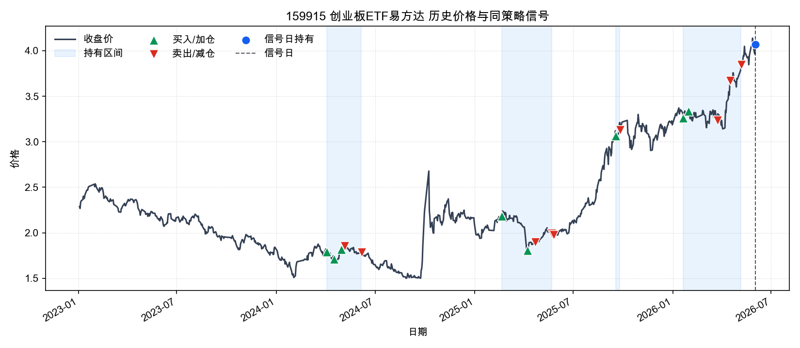

### 510300 沪深300ETF

- 买入/加仓: 18 次；卖出/减仓: 18 次；持有区间: 3 段；信号日权重: 10.02%
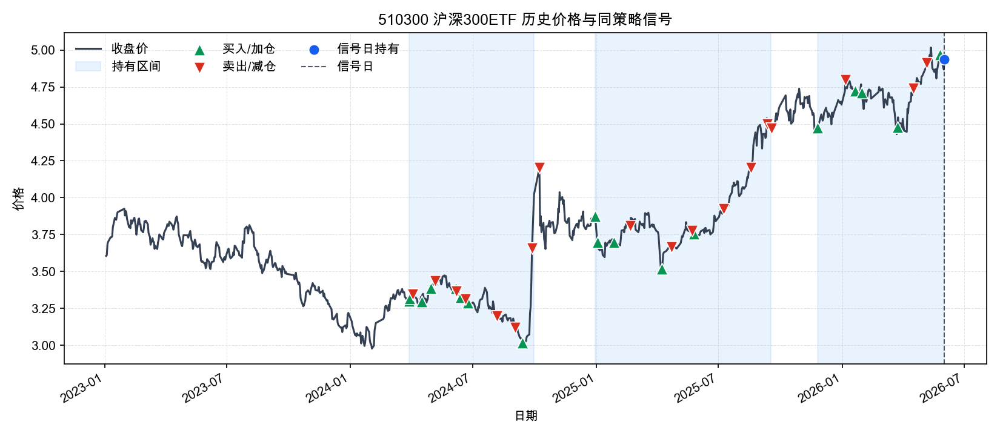

### 510500 中证500ETF

- 买入/加仓: 9 次；卖出/减仓: 10 次；持有区间: 4 段；信号日权重: 9.59%
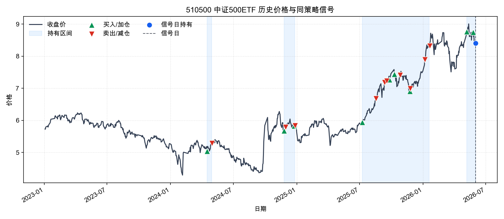

### 510880 红利ETF华泰柏瑞

- 买入/加仓: 10 次；卖出/减仓: 7 次；持有区间: 8 段；信号日权重: 10.38%
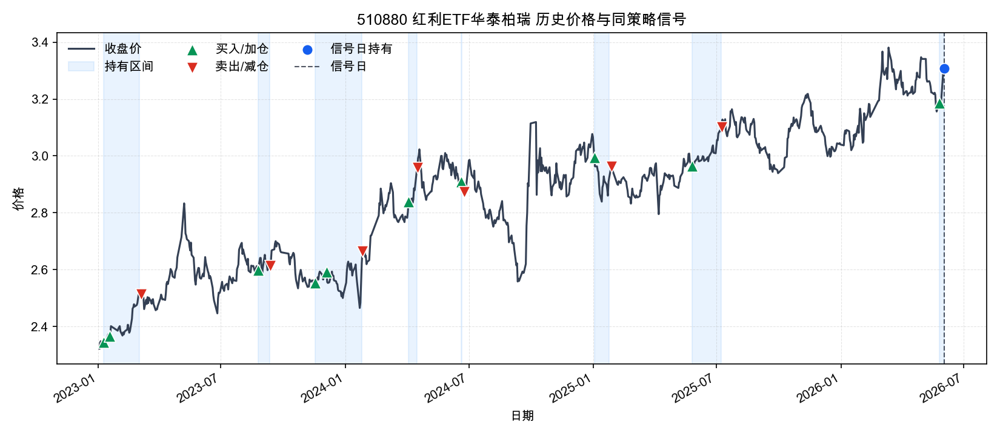

### 511520 政金债ETF富国

- 买入/加仓: 29 次；卖出/减仓: 31 次；持有区间: 1 段；信号日权重: 57.16%
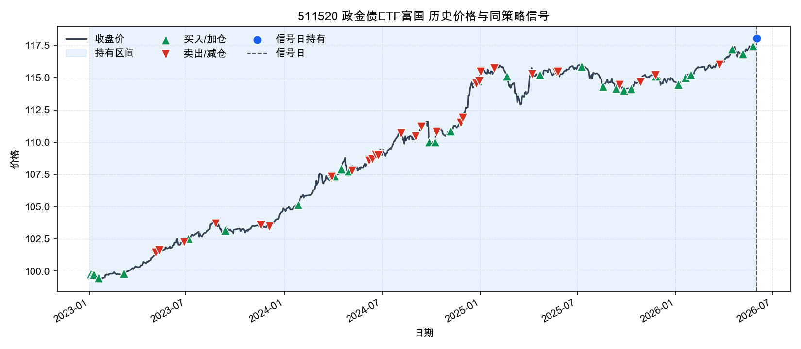

### 512400 有色金属ETF南方

- 买入/加仓: 8 次；卖出/减仓: 7 次；持有区间: 3 段；信号日权重: 16.91%
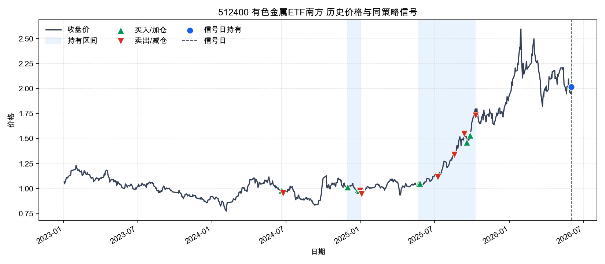

### 512480 半导体ETF

- 买入/加仓: 11 次；卖出/减仓: 14 次；持有区间: 5 段；信号日权重: 11.91%
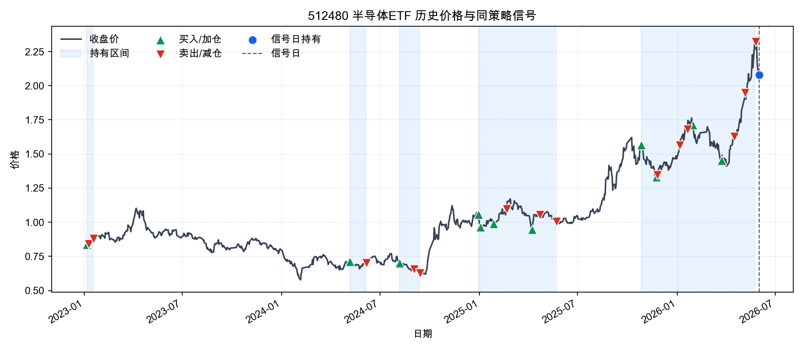

### 512690 酒ETF鹏华

- 买入/加仓: 2 次；卖出/减仓: 2 次；持有区间: 2 段；信号日权重: 11.07%
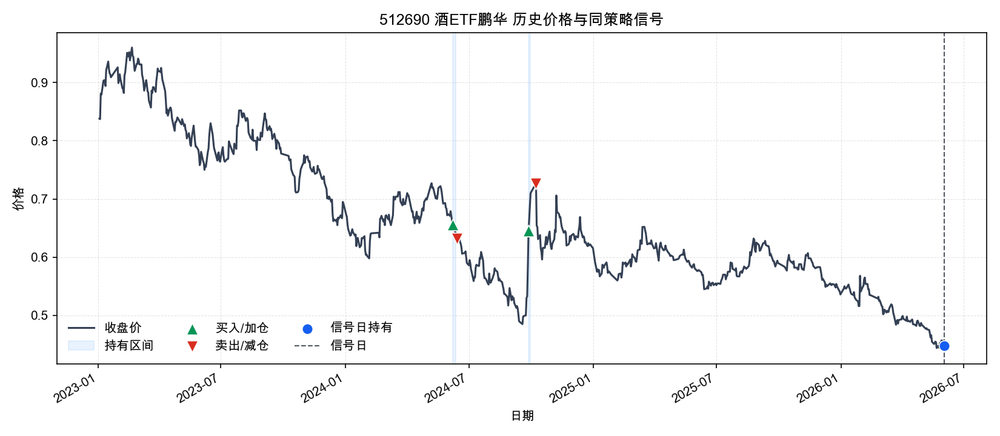

### 512880 证券ETF

- 买入/加仓: 8 次；卖出/减仓: 9 次；持有区间: 3 段；信号日权重: 9.88%
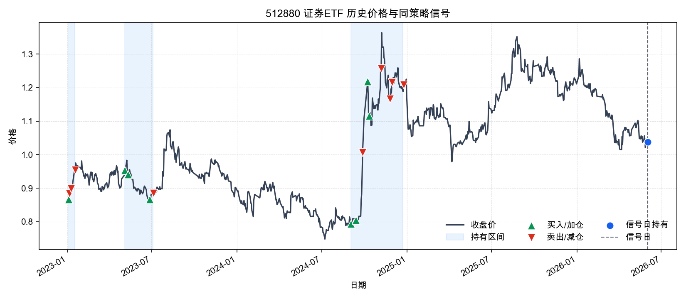

### 518880 黄金ETF华安

- 买入/加仓: 23 次；卖出/减仓: 37 次；持有区间: 1 段；信号日权重: 12.86%
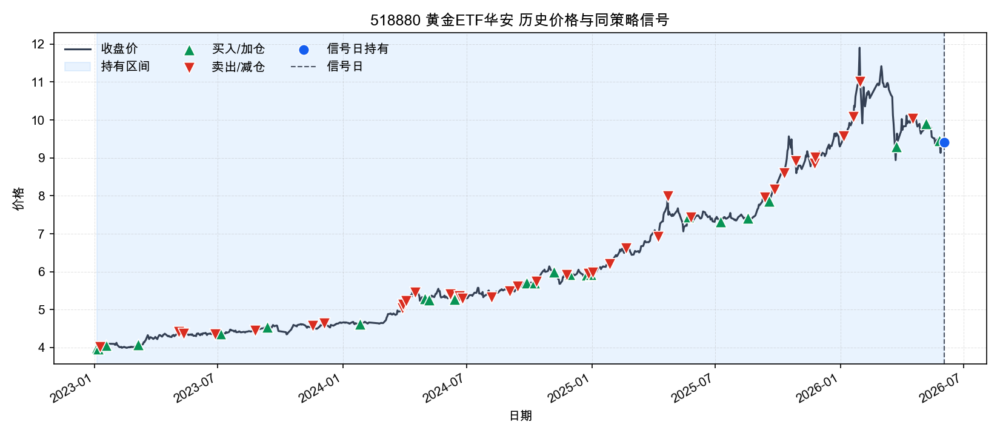

## 6. 估值绝对值与历史分位

**估值解读**
估值偏贵，股票ETF仓位更应依赖模型胜率和趋势确认，不适合仅因估值加仓。
- 510300 沪深300ETF、510500 中证500ETF、510880 红利ETF华泰柏瑞、512480 半导体ETF 的PE历史分位偏高，说明这部分股票ETF当前不是估值便宜驱动，追涨需要依赖盈利改善或动量延续。
- 512880 证券ETF 的PE历史分位偏低，估值安全边际相对更好，但仍需要结合趋势和模型胜率确认。
- 159915 创业板ETF易方达、512400 有色金属ETF南方、512690 酒ETF鹏华 估值处在历史中性区间，估值本身不是主要加减仓理由。
- 511520 政金债ETF富国、518880 黄金ETF华安 没有配置可比PE/PB底层指数；报告改用ETF自身价格分位做弱代理，不能直接解释为基本面便宜或昂贵。
- 511520 政金债ETF富国、518880 黄金ETF华安 的ETF价格处于自身历史高分位，缺少PE/PB时至少说明价格位置不低。

| 代码 | 名称 | 估值指数 | 估值代理 | PE | PE分位 | PB | PB分位 | 股息率 | 价格分位代理 | 估值口径 | 估值日期 | 备注 |
| --- | --- | --- | --- | --- | --- | --- | --- | --- | --- | --- | --- | --- |
| 159915 | 创业板ETF易方达 | 399006 | 399673 | 42.5100 | 73.81% | 7.5500 | 81.90% | N/A | 99.88% | 近似底层指数估值代理 + ETF价格分位 | 2026-05-29 | 使用 399673 作为估值代理；非精确跟踪指数。 |
| 510300 | 沪深300ETF | 000300 | N/A | 14.7300 | 90.40% | N/A | N/A | 2.54% | 99.27% | 底层指数PE/PB + ETF价格分位 | 2026-06-02 | N/A |
| 510500 | 中证500ETF | 000905 | N/A | 28.1800 | 93.73% | N/A | N/A | 1.30% | 95.15% | 底层指数PE/PB + ETF价格分位 | 2026-06-02 | N/A |
| 510880 | 红利ETF华泰柏瑞 | 000015 | N/A | 8.4600 | 91.51% | N/A | N/A | N/A | 98.67% | 底层指数PE/PB + ETF价格分位 | 2026-06-02 | N/A |
| 511520 | 政金债ETF富国 | N/A | N/A | N/A | N/A | N/A | N/A | N/A | 100.00% | 价格分位代理 | N/A | 当前ETF未配置底层估值指数；使用ETF自身价格分位作为弱代理，不能等同于基本面估值。 |
| 512400 | 有色金属ETF南方 | 000819 | N/A | 20.6200 | 65.71% | N/A | N/A | N/A | 90.90% | 底层指数PE/PB + ETF价格分位 | 2026-06-02 | N/A |
| 512480 | 半导体ETF | H30184 | N/A | 89.3300 | 84.44% | N/A | N/A | N/A | 98.79% | 底层指数PE/PB + ETF价格分位 | 2026-06-02 | N/A |
| 512690 | 酒ETF鹏华 | 399987 | N/A | 19.9500 | 26.35% | N/A | N/A | N/A | 0.61% | 底层指数PE/PB + ETF价格分位 | 2026-06-02 | N/A |
| 512880 | 证券ETF | 399975 | N/A | 14.6300 | 0.71% | N/A | N/A | N/A | 54.00% | 底层指数PE/PB + ETF价格分位 | 2026-06-02 | N/A |
| 518880 | 黄金ETF华安 | N/A | N/A | N/A | N/A | N/A | N/A | N/A | 88.23% | 价格分位代理 | N/A | 当前ETF未配置底层估值指数；使用ETF自身价格分位作为弱代理，不能等同于基本面估值。 |

## 7. 两融与机构资金流

**资金流解读**
资金面已纳入可取得的两融、ETF份额、成交额分位和主力资金代理；缺失的机构/北向字段不能当作确认信号。
- 两融、龙虎榜机构、大宗机构、北向资金净买额 当前没有有效入库，空值不能解读为资金中性，只能视为数据不可用或该ETF口径不适用。
- 主力资金代理口径净流入靠前的是 159915 创业板ETF易方达、518880 黄金ETF华安、510300 沪深300ETF，说明当日成交方向相对偏强。
- 主力资金代理口径净流出靠前的是 512690 酒ETF鹏华、510880 红利ETF华泰柏瑞、512480 半导体ETF，短线承接质量需要打折。
- 20日ETF份额扩张靠前的是 510300 沪深300ETF、510500 中证500ETF、512690 酒ETF鹏华，代表资金申购或规模扩张趋势更明显。
- 20日ETF份额收缩靠前的是 518880 黄金ETF华安、511520 政金债ETF富国、512400 有色金属ETF南方，说明资金持续性偏弱或产品规模收缩。
- 159915 创业板ETF易方达、510880 红利ETF华泰柏瑞 成交额处于近一年较高分位，信号更容易被市场快速定价，追高时要更重视回撤控制。

| 代码 | 名称 | 融资余额20日变化 | 主力净流入 |
| --- | --- | --- | --- |
| 159915 | 创业板ETF易方达 | N/A | +3,649,941,411.51 |
| 510300 | 沪深300ETF | -9.10% | +2,007,403,962.00 |
| 510500 | 中证500ETF | -19.60% | +1,490,335,906.36 |
| 510880 | 红利ETF华泰柏瑞 | 73.68% | -655,802,633.82 |
| 511520 | 政金债ETF富国 | -4.10% | +728,340,203.80 |
| 512400 | 有色金属ETF南方 | -0.80% | +1,044,602,693.65 |
| 512480 | 半导体ETF | -25.14% | +634,483,616.05 |
| 512690 | 酒ETF鹏华 | 0.48% | -765,394,287.00 |
| 512880 | 证券ETF | 6.18% | +812,911,160.76 |
| 518880 | 黄金ETF华安 | -2.09% | +2,870,889,482.43 |

## 8. 宏观环境

- 宏观日期: 2026-06-02。本节宏观数据按信号日可取得的最新缓存整理。
- M1同比: 5.00%。M1同比为正，说明狭义货币仍在扩张，但是否支持权益风险偏好要结合M1-M2剪刀差。
- M2同比: 8.60%。M2保持中高增速，说明总量流动性不紧，但不等同于资金进入权益市场。
- M1-M2剪刀差: -3.60%。M1明显弱于M2，资金偏沉淀或定期化，权益修复需要更多价格/政策确认。
- M2环比: -0.23%。M2环比下降，表示广义流动性边际回落，对短线风险偏好不是加分项。
- 中国10Y国债收益率: 1.70%。国内长端利率处在低位，降低权益估值折现压力并利好债券，但也可能反映增长预期偏弱。
- 中国10Y-2Y期限利差: 0.48%。期限利差温和为正，曲线信号中性。
- 7年国开债收益率: 1.68%。近20日下行 -0.10pct；约1年变化 -0.19pct，政策性金融债收益率回落通常利好政金债ETF净值表现，但也可能反映增长预期偏弱。
- 美国10Y国债收益率: 4.47%。最近有效值日期为 2026-06-01，美债收益率不算极端，作为海外估值压力的辅助变量观察。
- 美元人民币: 6.8187。数值下降代表人民币相对美元升值，数值上升代表人民币相对美元贬值。
- 美元人民币20日变化: -0.46%。美元人民币20日下降，意味着人民币阶段性升值，汇率压力边际缓和。
- 隔夜/最近美股S&P500变化: 0.26%。最新有效美股收盘为 2026-06-01，较上一有效日 2026-05-30 变化 0.26%；信号日没有新的美股收盘，不能把缓存持平误读为0.00%。
- 黄金20日变化: -4.32%。黄金20日明显下跌，避险资产短期动量转弱。

### 7年国开债收益率曲线

- 最新值: 1.68%（2026-06-02）
- 20日/约1年变化: -0.11pct / -0.09pct
- 近10年区间: 1.61%（2025-01-06）至 3.46%（2021-07-02）；当前分位 1.87%
- 数据来源: ChinaBond cbweb-mn yc/queryYz；样本区间 2021-07-02 至 2026-06-02

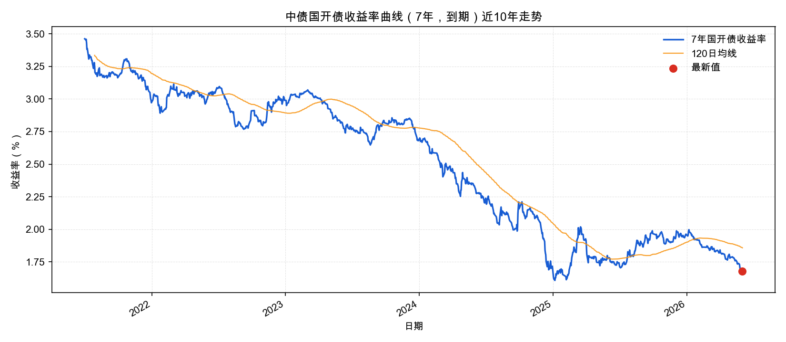

## 9. 当日宏观事件

### 2026-06-02 当日宏观与市场事件

- A股三大指数收涨，上证指数收报 4075.10 点，涨 0.43%；深证成指涨 1.63%；创业板指涨 2.66%；沪深两市成交额约 2.77 万亿元，较上一交易日缩量。影响: 科技成长修复但全市场分化仍大，风险偏好偏结构性而非全面扩张。来源: https://stock.jrj.com.cn/2026/06/02150857304325.shtml
- 盘面主线集中在 CPO、PCB、MLCC、光纤、通信设备等 AI 硬件链，体育、影视、文娱消费等方向走弱。影响: 支持半导体/科技成长的短线反弹，但应控制追高和拥挤交易风险。来源: https://finance.sina.com.cn/stock/bxjj/2026-06-02/doc-inhzzcpm4495896.shtml
- 经济参考报/新华网报道，6 月初资金面向宽，央行公开市场操作规模较 5 月中下旬明显下降，流动性管理更强调精准调控和价格稳定。影响: 短端流动性不构成明显收紧压力，但单日逆回购规模下降不宜简单解读为政策转向。来源: https://www.news.cn/20260602/e9fd750c5d7d4de3b376d69d8c21c250/c.html
- 国家统计局 5 月制造业 PMI 为 50.0%，较上月回落 0.3 个百分点；新订单指数 49.9%，生产指数 51.2%；非制造业商务活动指数 50.1%。影响: 经济仍在临界扩张附近，生产强于需求，权益仓位宜重结构、轻总量进攻。来源: https://www.stats.gov.cn/sj/zxfb/202605/t20260531_1963824.html
- 中国金融信息网援引央行数据，4 月末社融存量同比增长 7.8%，人民币各项贷款余额同比增长 5.6%，前四个月社融增量累计 15.45 万亿元、同比少 8930 亿元。影响: 融资条件仍偏宽，但信用扩张动能不强，降低顺周期和高 beta 板块的配置置信度。来源: https://www.cnfin.com/yw-lb/detail/20260514/4412666_1.html

制造业PMI: 50.0
非制造业PMI: 50.1
社融同比: 7.8

## 10. 数据质量提示

- 缓存最新日期: 2026-06-02
- 缺失ETF行情: 无
- 缺失宏观字段: us_10y_yield
- 缺失估值指数: 399006

这份报告是策略执行辅助，不构成投资建议。实际交易需要结合账户约束、成交滑点、税费和个人风险承受能力。
