# 下一交易日策略建议报告

- 信号日: 2026-06-05
- 执行日: 2026-06-08（估算）
- 策略: `strategies/stable_model_event_driven_rotation.py`
- 执行原则: 信号日收盘后生成目标仓位，下一交易日开盘执行。

## 1. 总结结论

次日开盘无需主动调仓，维持当前策略目标仓位。

- 预计换手率: 0.00%
- 估算交易成本: 0.00
- 历史外推6个月收益预期: 8.45%
- 历史外推12个月收益预期: 17.61%
- 历史最大回撤/压力回撤: -5.53% / -8.30%

## 2. 次日交易执行方案

| 代码 | 名称 | 动作 | 当前权重 | 目标权重 | 变化 | 估算金额 | 参考收盘价 | 估算份额 | 原因 |
| --- | --- | --- | --- | --- | --- | --- | --- | --- | --- |
| 510300 | 沪深300ETF | 持有 | 9.89% | 9.89% | +0.00% | +0.00 | 4.8430 | 0 | 继续持有，未触发交易事件: win=95.75%, payoff=82.86%, 60日动量=0.00%, 综合评分=0.900 |
| 510500 | 中证500ETF | 持有 | 9.56% | 9.56% | +0.00% | +0.00 | 8.3390 | 0 | 继续持有，未触发交易事件: win=95.75%, payoff=82.86%, 60日动量=0.00%, 综合评分=0.900 |
| 510880 | 红利ETF华泰柏瑞 | 持有 | 10.48% | 10.48% | +0.00% | +0.00 | 3.3210 | 0 | 继续持有，未触发交易事件: win=95.75%, payoff=82.86%, 60日动量=0.00%, 综合评分=0.900 |
| 511520 | 政金债ETF富国 | 持有 | 57.36% | 57.36% | +0.00% | +0.00 | 117.8210 | 0 | 事件驱动风险预算: 股票ETF实际目标=30.00%，剩余仓位配置政金债/黄金；每日收盘监控，只有机会或风险事件触发交易。 |
| 518880 | 黄金ETF华安 | 持有 | 12.71% | 12.71% | +0.00% | +0.00 | 9.2520 | 0 | 事件驱动风险预算: 股票ETF实际目标=30.00%，剩余仓位配置政金债/黄金；每日收盘监控，只有机会或风险事件触发交易。 |

说明: 金额和份额按报告资金规模估算，实际下单时应使用次日开盘可成交价格和账户真实持仓校正。

## 3. 模型信号与调仓理由

| 代码 | 名称 | 评分 | 策略解释 |
| --- | --- | --- | --- |
| 511520 | 政金债ETF富国 | 2.0000 | 事件驱动风险预算: 股票ETF实际目标=30.00%，剩余仓位配置政金债/黄金；每日收盘监控，只有机会或风险事件触发交易。 |
| 518880 | 黄金ETF华安 | 1.9000 | 事件驱动风险预算: 股票ETF实际目标=30.00%，剩余仓位配置政金债/黄金；每日收盘监控，只有机会或风险事件触发交易。 |
| 510500 | 中证500ETF | 0.8995 | 继续持有，未触发交易事件: win=95.75%, payoff=82.86%, 60日动量=0.00%, 综合评分=0.900 |
| 159915 | 创业板ETF易方达 | 0.8995 | 候选机会，仅监控未交易: win=95.75%, payoff=82.86%, 60日动量=0.00%, 综合评分=0.900 |
| 510880 | 红利ETF华泰柏瑞 | 0.8995 | 继续持有，未触发交易事件: win=95.75%, payoff=82.86%, 60日动量=0.00%, 综合评分=0.900 |
| 510300 | 沪深300ETF | 0.8995 | 继续持有，未触发交易事件: win=95.75%, payoff=82.86%, 60日动量=0.00%, 综合评分=0.900 |

## 4. 大盘与ETF交易状态

- ETF池上涨比例: 0.00%
- ETF池平均日收益: -1.41%
- 基准 510300 沪深300ETF: 1日/20日/60日收益 -1.68% / -0.88% / 4.62%
- 基准近120日回撤: -3.47%

| 代码 | 名称 | 收盘 | 1日 | 20日 | 60日 | 成交额分位 | 份额20日变化 | 折溢价 |
| --- | --- | --- | --- | --- | --- | --- | --- | --- |
| 159915 | 创业板ETF易方达 | 3.9770 | -3.00% | 4.49% | 24.24% | 84.52% | 8.34% | 0.00% |
| 510300 | 沪深300ETF | 4.8430 | -1.68% | -0.88% | 4.62% | 32.54% | 40.03% | 0.00% |
| 510500 | 中证500ETF | 8.3390 | -1.29% | -4.90% | -0.20% | 70.63% | 22.47% | 0.00% |
| 510880 | 红利ETF华泰柏瑞 | 3.3210 | -0.18% | 1.84% | 0.36% | 91.67% | 11.51% | 0.00% |
| 511520 | 政金债ETF富国 | 117.8210 | -0.04% | 0.72% | 1.80% | 1.59% | -3.64% | 0.00% |
| 512400 | 有色金属ETF南方 | 1.9260 | -2.23% | -12.69% | -14.67% | 48.81% | 1.01% | 0.00% |
| 512480 | 半导体ETF | 2.0910 | -4.65% | 9.94% | 34.56% | 56.35% | 15.13% | 0.00% |
| 512690 | 酒ETF鹏华 | 0.4330 | 0.00% | -9.03% | -14.26% | 35.71% | 21.32% | 0.00% |
| 512880 | 证券ETF | 1.0160 | -0.59% | -5.93% | -8.63% | 36.11% | 16.80% | 0.00% |
| 518880 | 黄金ETF华安 | 9.2520 | -0.41% | -6.36% | -14.87% | 25.40% | -30.45% | 0.00% |

## 5. 历史策略信号走势图

说明: 绿色▲表示买入/加仓，红色▼表示卖出/减仓，蓝色阴影表示同一策略历史持有区间，蓝色圆点表示信号日仍持有，黑色虚线表示当前信号日。

### 159915 创业板ETF易方达

- 买入/加仓: 8 次；卖出/减仓: 9 次；持有区间: 4 段；信号日权重: 10.18%
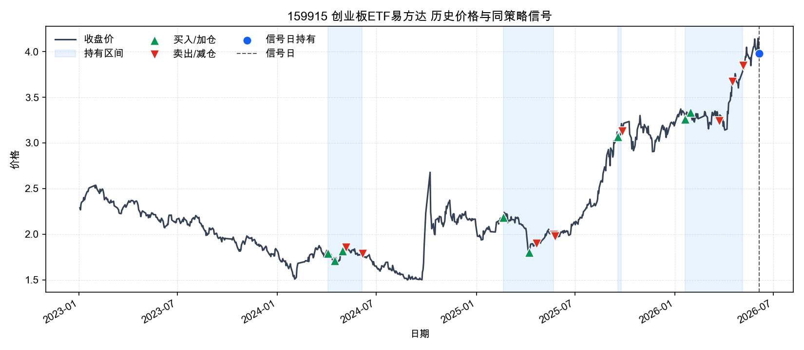

### 510300 沪深300ETF

- 买入/加仓: 18 次；卖出/减仓: 18 次；持有区间: 3 段；信号日权重: 9.89%
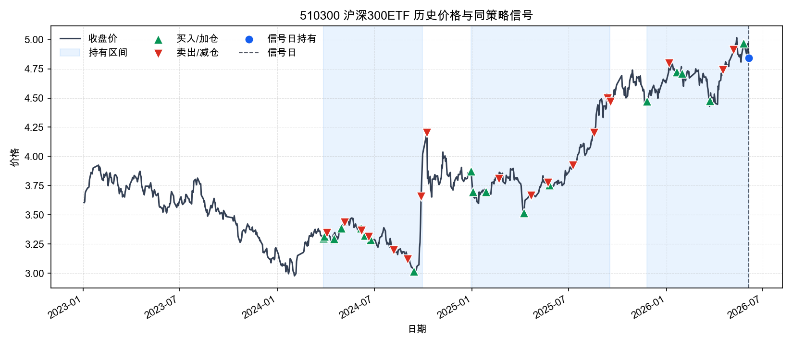

### 510500 中证500ETF

- 买入/加仓: 9 次；卖出/减仓: 10 次；持有区间: 4 段；信号日权重: 9.56%
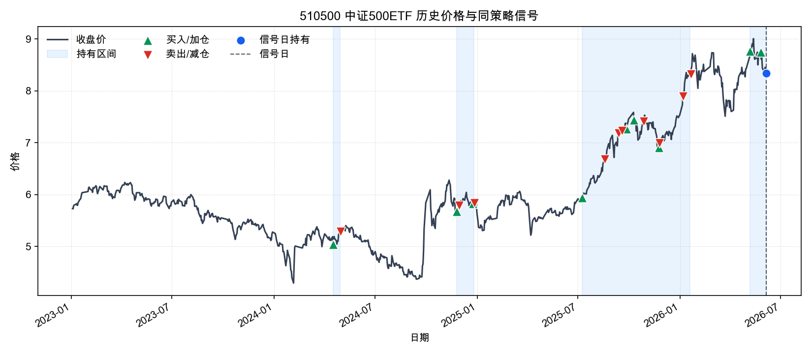

### 510880 红利ETF华泰柏瑞

- 买入/加仓: 10 次；卖出/减仓: 7 次；持有区间: 8 段；信号日权重: 10.48%
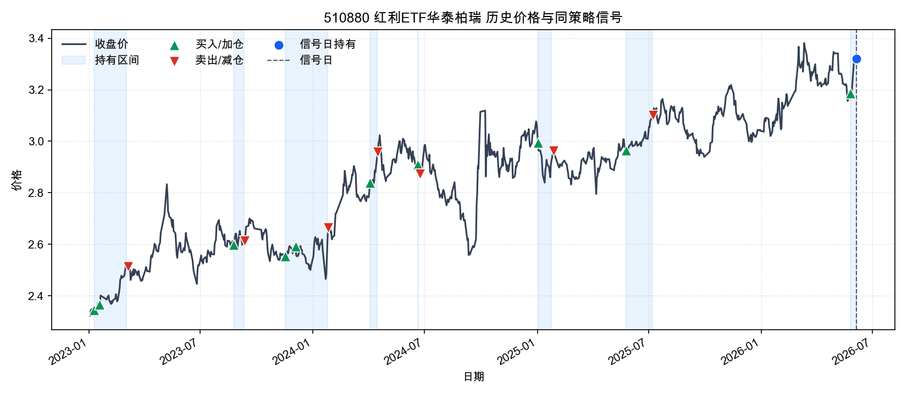

### 511520 政金债ETF富国

- 买入/加仓: 29 次；卖出/减仓: 31 次；持有区间: 1 段；信号日权重: 57.36%
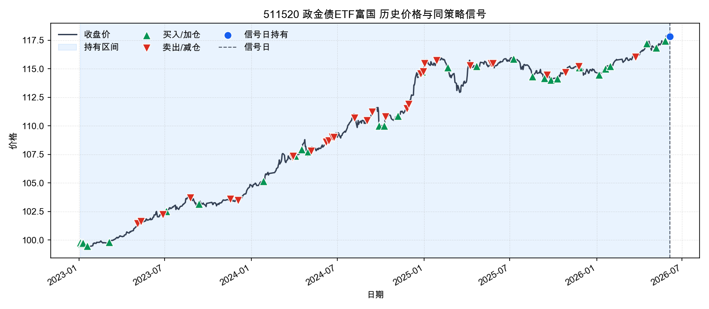

### 512400 有色金属ETF南方

- 买入/加仓: 8 次；卖出/减仓: 7 次；持有区间: 3 段；信号日权重: 16.91%
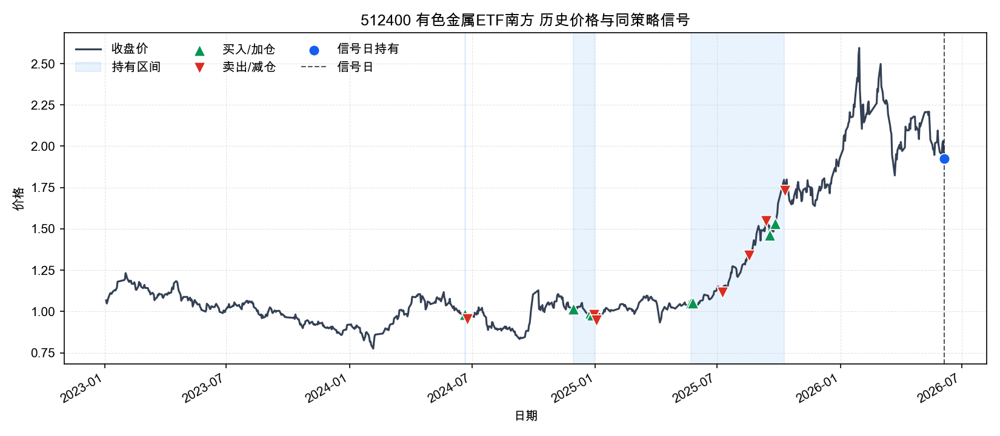

### 512480 半导体ETF

- 买入/加仓: 11 次；卖出/减仓: 14 次；持有区间: 5 段；信号日权重: 11.91%
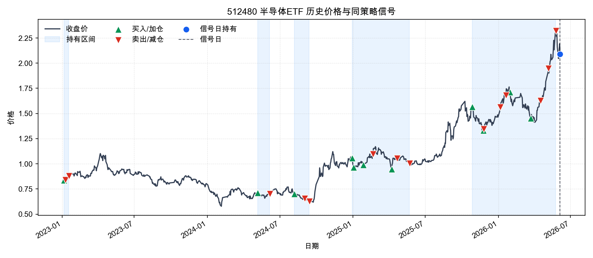

### 512690 酒ETF鹏华

- 买入/加仓: 2 次；卖出/减仓: 2 次；持有区间: 2 段；信号日权重: 11.07%
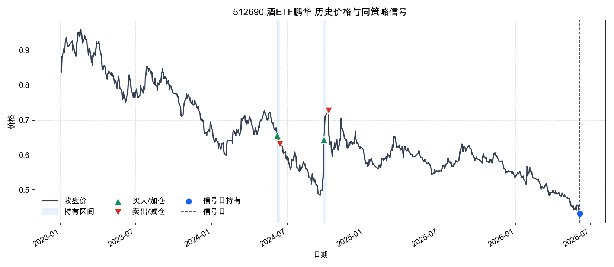

### 512880 证券ETF

- 买入/加仓: 8 次；卖出/减仓: 9 次；持有区间: 3 段；信号日权重: 9.88%
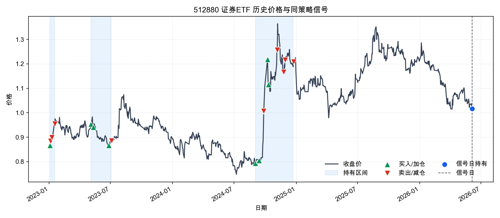

### 518880 黄金ETF华安

- 买入/加仓: 23 次；卖出/减仓: 37 次；持有区间: 1 段；信号日权重: 12.71%
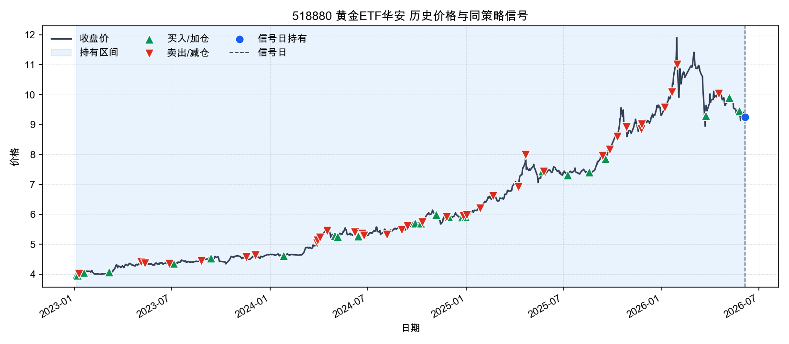

## 6. 估值绝对值与历史分位

**估值解读**
估值偏贵，股票ETF仓位更应依赖模型胜率和趋势确认，不适合仅因估值加仓。
- 510300 沪深300ETF、510500 中证500ETF、510880 红利ETF华泰柏瑞、512480 半导体ETF 的PE历史分位偏高，说明这部分股票ETF当前不是估值便宜驱动，追涨需要依赖盈利改善或动量延续。
- 512880 证券ETF 的PE历史分位偏低，估值安全边际相对更好，但仍需要结合趋势和模型胜率确认。
- 159915 创业板ETF易方达、512400 有色金属ETF南方、512690 酒ETF鹏华 估值处在历史中性区间，估值本身不是主要加减仓理由。
- 511520 政金债ETF富国、518880 黄金ETF华安 没有配置可比PE/PB底层指数；报告改用ETF自身价格分位做弱代理，不能直接解释为基本面便宜或昂贵。
- 511520 政金债ETF富国、518880 黄金ETF华安 的ETF价格处于自身历史高分位，缺少PE/PB时至少说明价格位置不低。

| 代码 | 名称 | 估值指数 | 估值代理 | PE | PE分位 | PB | PB分位 | 股息率 | 价格分位代理 | 估值口径 | 估值日期 | 备注 |
| --- | --- | --- | --- | --- | --- | --- | --- | --- | --- | --- | --- | --- |
| 159915 | 创业板ETF易方达 | 399006 | 399673 | 42.5100 | 73.81% | 7.5500 | 81.90% | N/A | 98.91% | 近似底层指数估值代理 + ETF价格分位 | 2026-05-29 | 使用 399673 作为估值代理；非精确跟踪指数。 |
| 510300 | 沪深300ETF | 000300 | N/A | 14.4300 | 83.89% | N/A | N/A | 2.54% | 97.46% | 底层指数PE/PB + ETF价格分位 | 2026-06-05 | N/A |
| 510500 | 中证500ETF | 000905 | N/A | 27.7400 | 92.86% | N/A | N/A | 1.30% | 93.11% | 底层指数PE/PB + ETF价格分位 | 2026-06-05 | N/A |
| 510880 | 红利ETF华泰柏瑞 | 000015 | N/A | 8.4500 | 91.27% | N/A | N/A | N/A | 98.79% | 底层指数PE/PB + ETF价格分位 | 2026-06-05 | N/A |
| 511520 | 政金债ETF富国 | N/A | N/A | N/A | N/A | N/A | N/A | N/A | 99.27% | 价格分位代理 | N/A | 当前ETF未配置底层估值指数；使用ETF自身价格分位作为弱代理，不能等同于基本面估值。 |
| 512400 | 有色金属ETF南方 | 000819 | N/A | 19.6200 | 61.03% | N/A | N/A | N/A | 88.39% | 底层指数PE/PB + ETF价格分位 | 2026-06-05 | N/A |
| 512480 | 半导体ETF | H30184 | N/A | 89.5800 | 85.00% | N/A | N/A | N/A | 98.67% | 底层指数PE/PB + ETF价格分位 | 2026-06-05 | N/A |
| 512690 | 酒ETF鹏华 | 399987 | N/A | 19.3700 | 21.67% | N/A | N/A | N/A | 0.24% | 底层指数PE/PB + ETF价格分位 | 2026-06-05 | N/A |
| 512880 | 证券ETF | 399975 | N/A | 14.3000 | 0.16% | N/A | N/A | N/A | 49.94% | 底层指数PE/PB + ETF价格分位 | 2026-06-05 | N/A |
| 518880 | 黄金ETF华安 | N/A | N/A | N/A | N/A | N/A | N/A | N/A | 86.46% | 价格分位代理 | N/A | 当前ETF未配置底层估值指数；使用ETF自身价格分位作为弱代理，不能等同于基本面估值。 |

## 7. 两融与机构资金流

**资金流解读**
资金面已纳入可取得的两融、ETF份额、成交额分位和主力资金代理；缺失的机构/北向字段不能当作确认信号。
- 龙虎榜机构、大宗机构、北向资金净买额 当前没有有效入库，空值不能解读为资金中性，只能视为数据不可用或该ETF口径不适用。
- 主力资金代理口径净流入靠前的是 518880 黄金ETF华安、512480 半导体ETF、510880 红利ETF华泰柏瑞，说明当日成交方向相对偏强。
- 主力资金代理口径净流出靠前的是 159915 创业板ETF易方达、510300 沪深300ETF、512880 证券ETF，短线承接质量需要打折。
- 融资余额近20日明显上升的是 512880 证券ETF，杠杆资金参与度增强，但也会提高拥挤回撤风险。
- 融资余额近20日明显下降的是 510880 红利ETF华泰柏瑞、510500 中证500ETF、512400 有色金属ETF南方，说明杠杆资金在撤出或降风险。
- 融资余额绝对规模靠前的是 518880 黄金ETF华安、512880 证券ETF、510300 沪深300ETF，这些标的需要额外关注杠杆拥挤和踩踏风险。
- 20日ETF份额扩张靠前的是 510300 沪深300ETF、510500 中证500ETF、512690 酒ETF鹏华，代表资金申购或规模扩张趋势更明显。
- 20日ETF份额收缩靠前的是 518880 黄金ETF华安、511520 政金债ETF富国、512400 有色金属ETF南方，说明资金持续性偏弱或产品规模收缩。
- 159915 创业板ETF易方达、510880 红利ETF华泰柏瑞 成交额处于近一年较高分位，信号更容易被市场快速定价，追高时要更重视回撤控制。

| 代码 | 名称 | 融资余额 | 融资余额20日变化 | 融资买入 | 主力净流入 |
| --- | --- | --- | --- | --- | --- |
| 159915 | 创业板ETF易方达 | N/A | N/A | N/A | -1,815,337,707.07 |
| 510300 | 沪深300ETF | 2,681,031,885.00 | -6.08% | 179,246,082.00 | -1,629,275,443.09 |
| 510500 | 中证500ETF | 751,741,843.00 | -21.60% | 235,701,689.00 | -942,400,009.63 |
| 510880 | 红利ETF华泰柏瑞 | 76,441,529.00 | -22.91% | 18,292,700.00 | -167,021,755.26 |
| 511520 | 政金债ETF富国 | 1,905,414,639.00 | -7.88% | 102,746,292.00 | -675,523,497.69 |
| 512400 | 有色金属ETF南方 | 427,634,449.00 | -18.02% | 39,144,184.00 | -566,732,804.83 |
| 512480 | 半导体ETF | 303,161,857.00 | -14.03% | 76,179,831.00 | -80,042,731.74 |
| 512690 | 酒ETF鹏华 | 853,501,212.00 | 2.66% | 127,404,554.00 | -565,429,746.45 |
| 512880 | 证券ETF | 4,132,719,836.00 | 7.40% | 327,587,137.00 | -1,130,467,304.25 |
| 518880 | 黄金ETF华安 | 6,428,488,224.00 | -2.69% | 266,228,915.00 | +8,368,975.71 |

## 8. 宏观环境

- 宏观日期: 2026-06-05。本节宏观数据按信号日可取得的最新缓存整理。
- M1同比: 5.00%。M1同比为正，说明狭义货币仍在扩张，但是否支持权益风险偏好要结合M1-M2剪刀差。
- M2同比: 8.60%。M2保持中高增速，说明总量流动性不紧，但不等同于资金进入权益市场。
- M1-M2剪刀差: -3.60%。M1明显弱于M2，资金偏沉淀或定期化，权益修复需要更多价格/政策确认。
- M2环比: -0.23%。M2环比下降，表示广义流动性边际回落，对短线风险偏好不是加分项。
- 中国10Y国债收益率: 1.72%。国内长端利率处在低位，降低权益估值折现压力并利好债券，但也可能反映增长预期偏弱。
- 中国10Y-2Y期限利差: 0.48%。期限利差温和为正，曲线信号中性。
- 7年国开债收益率: 1.68%。近20日下行 -0.10pct；约1年变化 -0.12pct，政策性金融债收益率回落通常利好政金债ETF净值表现，但也可能反映增长预期偏弱。
- 美国10Y国债收益率: 4.55%。美债收益率偏高，通常压制成长资产估值并提高全球风险资产波动。
- 美元人民币: 6.8157。数值下降代表人民币相对美元升值，数值上升代表人民币相对美元贬值。
- 美元人民币20日变化: -0.40%。美元人民币20日下降，意味着人民币阶段性升值，汇率压力边际缓和。
- 隔夜/最近美股S&P500变化: -2.64%。S&P500下跌，隔夜外盘风险偏好对A股开盘情绪偏负面。
- 黄金20日变化: -5.40%。黄金20日明显下跌，避险资产短期动量转弱。

### 7年国开债收益率曲线

- 最新值: 1.68%（2026-06-05）
- 20日/约1年变化: -0.10pct / -0.12pct
- 近10年区间: 1.61%（2025-01-06）至 5.13%（2018-01-18）；当前分位 1.08%
- 数据来源: ChinaBond cbweb-mn yc/queryYz；样本区间 2016-06-06 至 2026-06-05

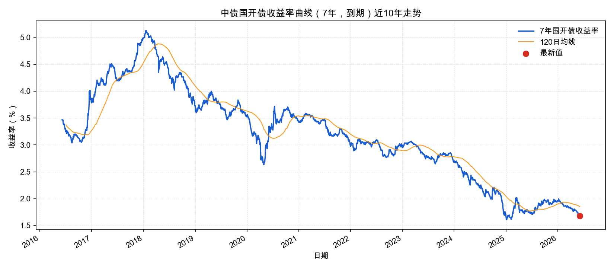

## 9. 当日宏观事件

### 2026-06-05 当日宏观与市场事件

- A 股 6 月 5 日集体调整：上证指数收 4027.74 点，跌 0.74%；深证成指收 15314.70 点，跌 2.21%；创业板指收 3957.93 点，跌 3.20%；沪深两市成交额约 3.07 万亿元，较上一交易日放量 3115 亿元。影响: 成交放大但指数回撤，说明资金分歧和高位兑现压力上升，成长/科技 ETF 的追涨胜率下降，执行宜重视仓位纪律。来源: https://www.cnfin.com/yw-lb/detail/20260605/4422483_1.html
- 盘面结构上，玻璃基板、人形机器人等概念逆势活跃，半导体、培育钻石、MLCC、存储芯片等回调，电力板块大跌；北证 50 涨 5.59%。影响: 主题轮动仍强，但主线内部拥挤度升高，行业 ETF 配置更适合等待回撤后的确认信号，而不是在放量下跌日追高。来源: https://www.stcn.com/article/detail/3945831.html
- 央行 6 月 5 日开展 5000 亿元 3 个月期买断式逆回购操作，期限 92 天，到期日为 2026 年 9 月 5 日遇节假日顺延。影响: 中期流动性维持呵护，但操作被市场解读为连续缩量续作，流动性宽松仍在，强度不宜外推为全面风险偏好上行。来源: https://www.chinanews.com.cn/cj/2026/06-04/10634376.shtml
- 国家统计局 5 月制造业 PMI 为 50.0%，较上月下降 0.3 个百分点；非制造业商务活动指数 50.1%，较上月上升 0.7 个百分点；综合 PMI 产出指数 50.5%。影响: 经济产出仍在扩张区间，但制造业需求接近临界点，权益配置应偏结构性景气和防守均衡。来源: https://www.stats.gov.cn/sj/zxfb/202605/t20260531_1963824.html
- 最近可得信用口径仍为 2026 年 4 月：M2 同比 8.6%，M1 同比 5.0%，社会融资规模存量同比 7.8%，前四个月社融增量同比少 8930 亿元。影响: 货币不紧但信用扩张一般，顺周期总量资产的胜率弱于有独立产业催化或红利/债券防守资产。来源: https://www.cnfin.com/yw-lb/detail/20260514/4412666_1.html
- 美国劳工统计局公布 5 月非农就业新增 17.2 万人，失业率维持 4.3%；AP 报道 6 月 5 日标普 500 下跌 2.6%、纳指下跌 4.2%，债券收益率因强就业数据上行。影响: 外部利率和美股科技波动对 A 股高估值成长、半导体和港股互联网风险偏好构成短线压制。来源: https://www.bls.gov/news.release/archives/empsit_06052026.htm ; https://apnews.com/article/b9d2661cbba6cc326c618c06769d8291

制造业PMI: 50.0
非制造业PMI: 50.1
社融同比: 7.8
CPI同比: 1.2

## 10. 数据质量提示

- 缓存最新日期: 2026-06-05
- 缺失ETF行情: 无
- 缺失宏观字段: 无
- 缺失估值指数: 399006

这份报告是策略执行辅助，不构成投资建议。实际交易需要结合账户约束、成交滑点、税费和个人风险承受能力。
