# 下一交易日策略建议报告

- 信号日: 2026-06-08
- 执行日: 2026-06-09（估算）
- 策略: `strategies/stable_model_event_driven_rotation.py`
- 执行原则: 信号日收盘后生成目标仓位，下一交易日开盘执行。

## 1. 总结结论

次日开盘无需主动调仓，维持当前策略目标仓位。

- 预计换手率: 0.00%
- 估算交易成本: 0.00
- 历史外推6个月收益预期: 8.27%
- 历史外推12个月收益预期: 17.22%
- 历史最大回撤/压力回撤: -5.53% / -8.30%

## 2. 次日交易执行方案

| 代码 | 名称 | 动作 | 当前权重 | 目标权重 | 变化 | 估算金额 | 参考收盘价 | 估算份额 | 原因 |
| --- | --- | --- | --- | --- | --- | --- | --- | --- | --- |
| 510300 | 沪深300ETF | 持有 | 14.62% | 14.62% | +0.00% | +0.00 | 4.7390 | 0 | 继续持有，未触发交易事件: win=90.26%, payoff=97.08%, 60日动量=1.20%, 综合评分=0.936 |
| 510880 | 红利ETF华泰柏瑞 | 持有 | 15.12% | 15.12% | +0.00% | +0.00 | 3.3040 | 0 | 继续持有，未触发交易事件: win=91.59%, payoff=62.80%, 60日动量=1.04%, 综合评分=0.788 |
| 511520 | 政金债ETF富国 | 持有 | 57.61% | 57.61% | +0.00% | +0.00 | 117.6400 | 0 | 事件驱动风险预算: 股票ETF实际目标=30.00%，剩余仓位配置政金债/黄金；每日收盘监控，只有机会或风险事件触发交易。 |
| 518880 | 黄金ETF华安 | 持有 | 12.65% | 12.65% | +0.00% | +0.00 | 8.9530 | 0 | 事件驱动风险预算: 股票ETF实际目标=30.00%，剩余仓位配置政金债/黄金；每日收盘监控，只有机会或风险事件触发交易。 |

说明: 金额和份额按报告资金规模估算，实际下单时应使用次日开盘可成交价格和账户真实持仓校正。

## 3. 模型信号与调仓理由

| 代码 | 名称 | 评分 | 策略解释 |
| --- | --- | --- | --- |
| 511520 | 政金债ETF富国 | 2.0000 | 事件驱动风险预算: 股票ETF实际目标=30.00%，剩余仓位配置政金债/黄金；每日收盘监控，只有机会或风险事件触发交易。 |
| 518880 | 黄金ETF华安 | 1.9000 | 事件驱动风险预算: 股票ETF实际目标=30.00%，剩余仓位配置政金债/黄金；每日收盘监控，只有机会或风险事件触发交易。 |
| 510300 | 沪深300ETF | 0.9357 | 继续持有，未触发交易事件: win=90.26%, payoff=97.08%, 60日动量=1.20%, 综合评分=0.936 |
| 159915 | 创业板ETF易方达 | 0.8548 | 候选机会，仅监控未交易: win=82.76%, payoff=81.65%, 60日动量=16.11%, 综合评分=0.855 |
| 510880 | 红利ETF华泰柏瑞 | 0.7884 | 继续持有，未触发交易事件: win=91.59%, payoff=62.80%, 60日动量=1.04%, 综合评分=0.788 |

## 4. 大盘与ETF交易状态

- ETF池上涨比例: 0.00%
- ETF池平均日收益: -2.41%
- 基准 510300 沪深300ETF: 1日/20日/60日收益 -2.15% / -4.57% / 1.20%
- 基准近120日回撤: -5.54%

| 代码 | 名称 | 收盘 | 1日 | 20日 | 60日 | 成交额分位 | 份额20日变化 | 折溢价 |
| --- | --- | --- | --- | --- | --- | --- | --- | --- |
| 159915 | 创业板ETF易方达 | 3.8270 | -3.77% | -3.04% | 16.11% | 90.48% | 7.87% | N/A |
| 510300 | 沪深300ETF | 4.7390 | -2.15% | -4.57% | 1.20% | 68.25% | 35.64% | N/A |
| 510500 | 中证500ETF | 8.0680 | -3.25% | -9.47% | -4.87% | 72.62% | 20.17% | N/A |
| 510880 | 红利ETF华泰柏瑞 | 3.3040 | -0.51% | 1.26% | 1.04% | 75.40% | 11.28% | N/A |
| 511520 | 政金债ETF富国 | 117.6400 | -0.15% | 0.53% | 1.63% | 14.29% | -2.95% | N/A |
| 511580 | 国债政金债ETF招商 | 109.3550 | -0.01% | 0.18% | 0.52% | 90.48% | 17.55% | N/A |
| 512400 | 有色金属ETF南方 | 1.8200 | -5.50% | -17.57% | -20.14% | 72.22% | 1.93% | N/A |
| 512480 | 半导体ETF | 1.9950 | -4.59% | -1.14% | 25.08% | 63.89% | 14.45% | N/A |
| 512690 | 酒ETF鹏华 | 0.4250 | -1.85% | -10.53% | -16.34% | 30.95% | 20.59% | N/A |
| 512880 | 证券ETF | 1.0010 | -1.48% | -8.75% | -10.63% | 53.97% | 15.71% | N/A |
| 518880 | 黄金ETF华安 | 8.9530 | -3.23% | -8.40% | -18.28% | 57.14% | -28.05% | N/A |

## 5. 历史策略信号走势图

说明: 绿色▲表示买入/加仓，红色▼表示卖出/减仓，蓝色阴影表示同一策略历史持有区间，蓝色圆点表示信号日仍持有，黑色虚线表示当前信号日。

### 159915 创业板ETF易方达

- 买入/加仓: 8 次；卖出/减仓: 9 次；持有区间: 4 段；信号日权重: 10.24%
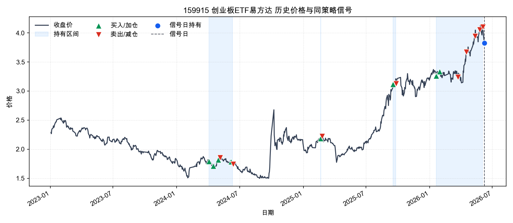

### 510300 沪深300ETF

- 买入/加仓: 20 次；卖出/减仓: 17 次；持有区间: 3 段；信号日权重: 14.62%
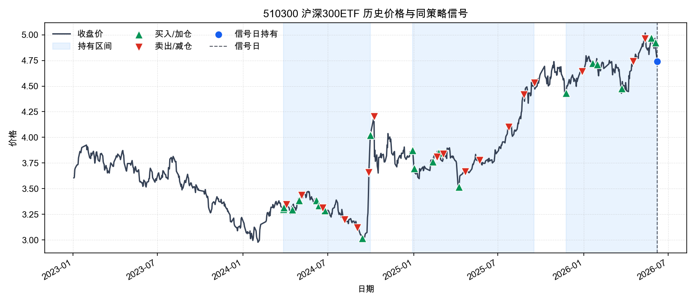

### 510500 中证500ETF

- 买入/加仓: 7 次；卖出/减仓: 12 次；持有区间: 3 段；信号日权重: 10.74%
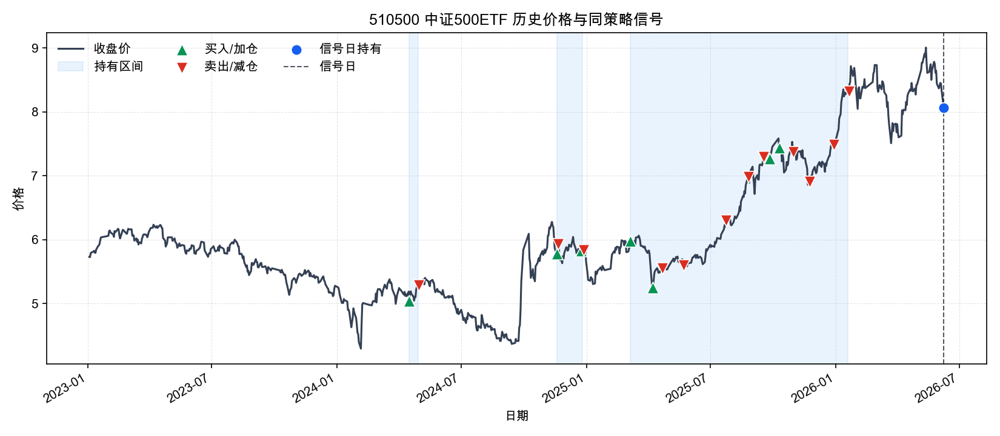

### 510880 红利ETF华泰柏瑞

- 买入/加仓: 10 次；卖出/减仓: 6 次；持有区间: 7 段；信号日权重: 15.12%
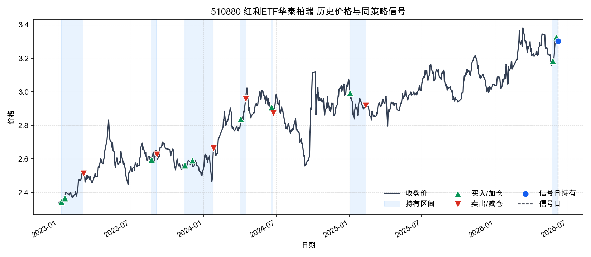

### 511520 政金债ETF富国

- 买入/加仓: 35 次；卖出/减仓: 25 次；持有区间: 1 段；信号日权重: 57.61%
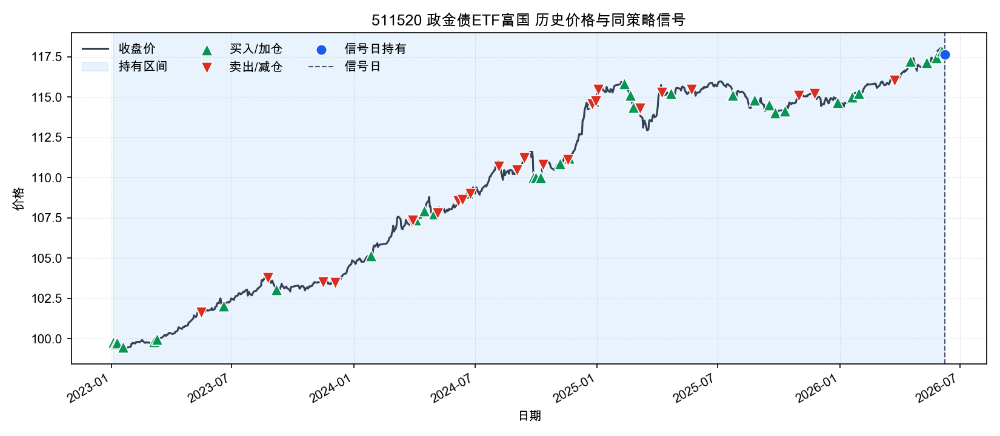

### 511580 国债政金债ETF招商

- 买入/加仓: 0 次；卖出/减仓: 0 次；持有区间: 0 段；信号日权重: 0.00%
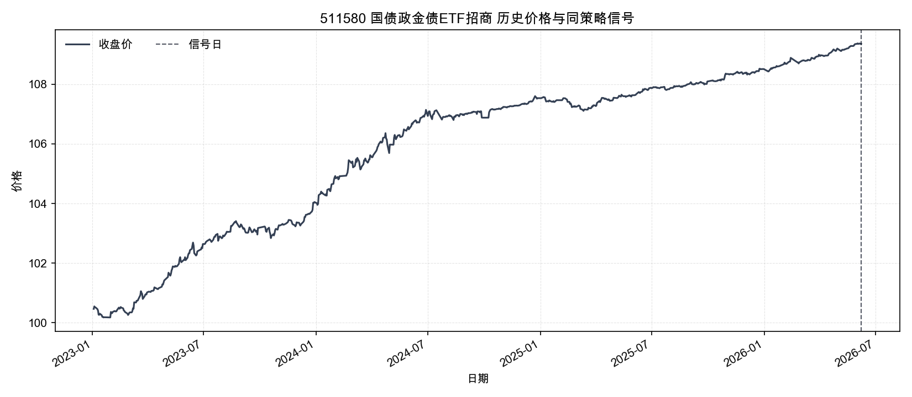

### 512400 有色金属ETF南方

- 买入/加仓: 5 次；卖出/减仓: 8 次；持有区间: 4 段；信号日权重: 16.91%
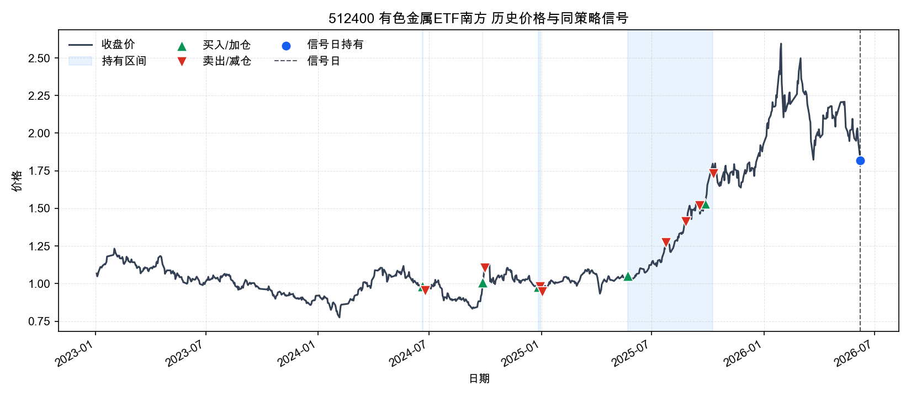

### 512480 半导体ETF

- 买入/加仓: 10 次；卖出/减仓: 15 次；持有区间: 5 段；信号日权重: 11.51%
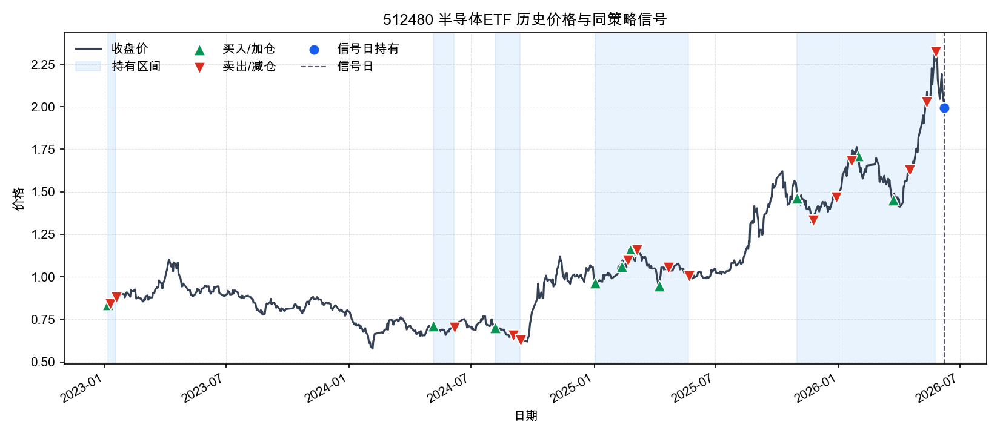

### 512690 酒ETF鹏华

- 买入/加仓: 2 次；卖出/减仓: 3 次；持有区间: 1 段；信号日权重: 9.95%
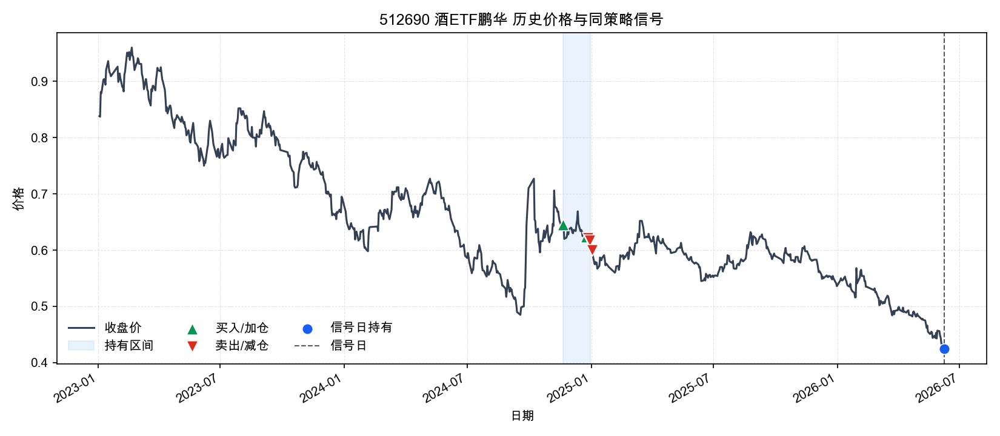

### 512880 证券ETF

- 买入/加仓: 10 次；卖出/减仓: 9 次；持有区间: 3 段；信号日权重: 9.65%
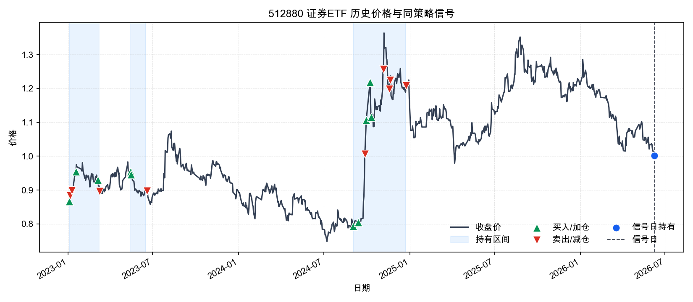

### 518880 黄金ETF华安

- 买入/加仓: 27 次；卖出/减仓: 33 次；持有区间: 1 段；信号日权重: 12.65%
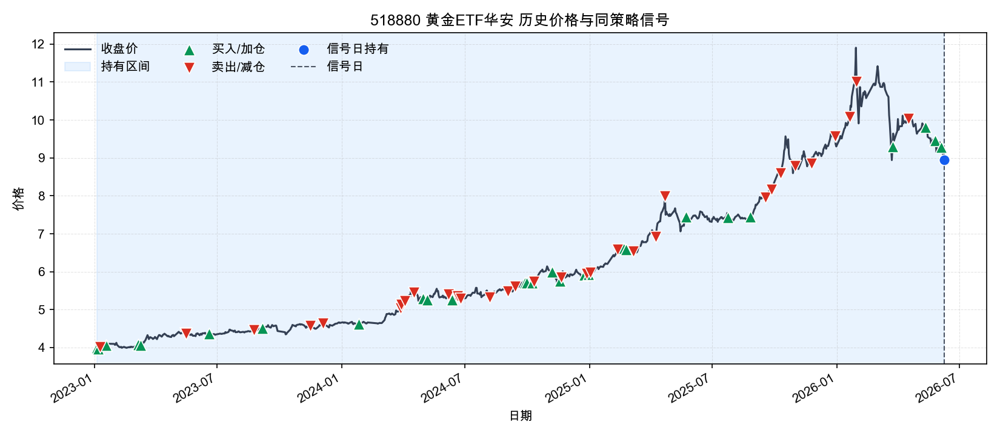

## 6. 估值绝对值与历史分位

**估值解读**
估值存在一定安全边际，但仍不应覆盖模型风险信号。
- 510500 中证500ETF、510880 红利ETF华泰柏瑞、512480 半导体ETF 的PE历史分位偏高，说明这部分股票ETF当前不是估值便宜驱动，追涨需要依赖盈利改善或动量延续。
- 512690 酒ETF鹏华、512880 证券ETF 的PE历史分位偏低，估值安全边际相对更好，但仍需要结合趋势和模型胜率确认。
- 159915 创业板ETF易方达、510300 沪深300ETF、512400 有色金属ETF南方 估值处在历史中性区间，估值本身不是主要加减仓理由。
- 511520 政金债ETF富国、511580 国债政金债ETF招商、518880 黄金ETF华安 没有配置可比PE/PB底层指数；报告改用ETF自身价格分位做弱代理，不能直接解释为基本面便宜或昂贵。
- 511520 政金债ETF富国、511580 国债政金债ETF招商、518880 黄金ETF华安 的ETF价格处于自身历史高分位，缺少PE/PB时至少说明价格位置不低。

| 代码 | 名称 | 估值指数 | 估值代理 | PE | PE分位 | PB | PB分位 | 股息率 | 价格分位代理 | 估值口径 | 估值日期 | 备注 |
| --- | --- | --- | --- | --- | --- | --- | --- | --- | --- | --- | --- | --- |
| 159915 | 创业板ETF易方达 | 399006 | 399673 | 39.9700 | 69.29% | 7.1000 | 79.37% | N/A | 97.46% | 近似底层指数估值代理 + ETF价格分位 | 2026-06-08 | 使用 399673 作为估值代理；非精确跟踪指数。 |
| 510300 | 沪深300ETF | 000300 | N/A | 14.2400 | 77.54% | N/A | N/A | 2.54% | 94.81% | 底层指数PE/PB + ETF价格分位 | 2026-06-08 | N/A |
| 510500 | 中证500ETF | 000905 | N/A | 26.8100 | 90.87% | N/A | N/A | 1.30% | 90.58% | 底层指数PE/PB + ETF价格分位 | 2026-06-08 | N/A |
| 510880 | 红利ETF华泰柏瑞 | 000015 | N/A | 8.6100 | 94.29% | N/A | N/A | N/A | 97.95% | 底层指数PE/PB + ETF价格分位 | 2026-06-08 | N/A |
| 511520 | 政金债ETF富国 | N/A | N/A | N/A | N/A | N/A | N/A | N/A | 99.03% | 价格分位代理 | N/A | 当前ETF未配置底层估值指数；使用ETF自身价格分位作为弱代理，不能等同于基本面估值。 |
| 511580 | 国债政金债ETF招商 | N/A | N/A | N/A | N/A | N/A | N/A | N/A | 99.64% | 价格分位代理 | N/A | 当前ETF未配置底层估值指数；使用ETF自身价格分位作为弱代理，不能等同于基本面估值。 |
| 512400 | 有色金属ETF南方 | 000819 | N/A | 18.5100 | 55.24% | N/A | N/A | N/A | 86.96% | 底层指数PE/PB + ETF价格分位 | 2026-06-08 | N/A |
| 512480 | 半导体ETF | H30184 | N/A | 85.8300 | 80.87% | N/A | N/A | N/A | 97.58% | 底层指数PE/PB + ETF价格分位 | 2026-06-08 | N/A |
| 512690 | 酒ETF鹏华 | 399987 | N/A | 19.1400 | 18.65% | N/A | N/A | N/A | 0.12% | 底层指数PE/PB + ETF价格分位 | 2026-06-08 | N/A |
| 512880 | 证券ETF | 399975 | N/A | 14.0800 | 0.08% | N/A | N/A | N/A | 48.91% | 底层指数PE/PB + ETF价格分位 | 2026-06-08 | N/A |
| 518880 | 黄金ETF华安 | N/A | N/A | N/A | N/A | N/A | N/A | N/A | 83.21% | 价格分位代理 | N/A | 当前ETF未配置底层估值指数；使用ETF自身价格分位作为弱代理，不能等同于基本面估值。 |

## 7. 两融与机构资金流

**资金流解读**
资金面已纳入可取得的两融、ETF份额、成交额分位和主力资金代理；缺失的机构/北向字段不能当作确认信号。
- 两融、龙虎榜机构、大宗机构、北向资金净买额 当前没有有效入库，空值不能解读为资金中性，只能视为数据不可用或该ETF口径不适用。
- 20日ETF份额扩张靠前的是 510300 沪深300ETF、512690 酒ETF鹏华、510500 中证500ETF，代表资金申购或规模扩张趋势更明显。
- 20日ETF份额收缩靠前的是 518880 黄金ETF华安、511520 政金债ETF富国、512400 有色金属ETF南方，说明资金持续性偏弱或产品规模收缩。
- 159915 创业板ETF易方达、511580 国债政金债ETF招商 成交额处于近一年较高分位，信号更容易被市场快速定价，追高时要更重视回撤控制。

| 代码 | 名称 | 融资余额20日变化 |
| --- | --- | --- |
| 159915 | 创业板ETF易方达 | N/A |
| 510300 | 沪深300ETF | -9.05% |
| 510500 | 中证500ETF | -20.68% |
| 510880 | 红利ETF华泰柏瑞 | -26.86% |
| 511520 | 政金债ETF富国 | -8.72% |
| 511580 | 国债政金债ETF招商 | N/A |
| 512400 | 有色金属ETF南方 | -18.56% |
| 512480 | 半导体ETF | -9.16% |
| 512690 | 酒ETF鹏华 | 0.08% |
| 512880 | 证券ETF | 5.92% |
| 518880 | 黄金ETF华安 | -2.33% |

## 8. 宏观环境

- 宏观日期: 2026-06-08。本节宏观数据按信号日可取得的最新缓存整理。
- M1同比: 5.00%。M1同比为正，说明狭义货币仍在扩张，但是否支持权益风险偏好要结合M1-M2剪刀差。
- M2同比: 8.60%。M2保持中高增速，说明总量流动性不紧，但不等同于资金进入权益市场。
- M1-M2剪刀差: -3.60%。M1明显弱于M2，资金偏沉淀或定期化，权益修复需要更多价格/政策确认。
- M2环比: -0.23%。M2环比下降，表示广义流动性边际回落，对短线风险偏好不是加分项。
- 中国10Y国债收益率: 1.73%。国内长端利率处在低位，降低权益估值折现压力并利好债券，但也可能反映增长预期偏弱。
- 中国10Y-2Y期限利差: 0.47%。期限利差温和为正，曲线信号中性。
- 7年国开债收益率: 1.69%。近20日下行 -0.08pct；约1年变化 -0.09pct，政策性金融债收益率回落通常利好政金债ETF净值表现，但也可能反映增长预期偏弱。
- 美国10Y国债收益率: 4.55%。最近有效值日期为 2026-06-05，美债收益率偏高，通常压制成长资产估值并提高全球风险资产波动。
- 美元人民币: 6.8198。数值下降代表人民币相对美元升值，数值上升代表人民币相对美元贬值。
- 美元人民币20日变化: -0.32%。美元人民币20日下降，意味着人民币阶段性升值，汇率压力边际缓和。
- 隔夜/最近美股S&P500变化: -2.64%。最新有效美股收盘为 2026-06-05，较上一有效日 2026-06-04 变化 -2.64%；信号日没有新的美股收盘，不能把缓存持平误读为0.00%。
- 黄金20日变化: -6.46%。黄金20日明显下跌，避险资产短期动量转弱。

### 7年国开债收益率曲线

- 最新值: 1.69%（2026-06-08）
- 20日/约1年变化: -0.08pct / -0.09pct
- 近10年区间: 1.61%（2025-01-06）至 5.13%（2018-01-18）；当前分位 1.52%
- 数据来源: ChinaBond cbweb-mn yc/queryYz；样本区间 2016-06-08 至 2026-06-08

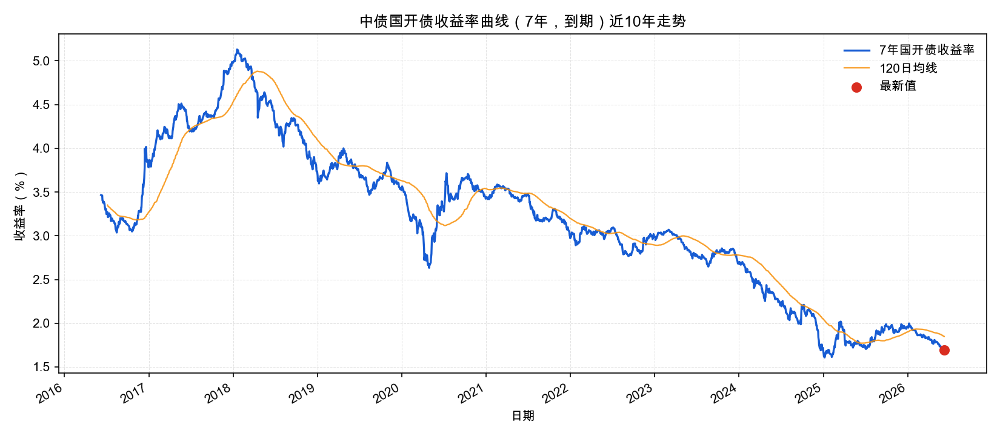

## 9. 当日宏观事件

# 2026-06-08 宏观与市场事件笔记

## 市场与风险偏好

- 事件日期：2026-06-08
- 来源：https://news.10jqka.com.cn/20260608/c677289628.shtml
- 事实：A 股主要指数集体收跌，上证指数跌 1.70%，深证成指跌 3.22%，创业板指跌 3.69%，沪深300跌 2.14%，科创50跌 4.30%；两市成交额约 2.79 万亿元。
- 影响：风险偏好明显降温，成长、科技和高 beta 风格承压；下一交易日不宜主动提高权益 ETF 总仓位，优先观察成交额是否继续收缩以及指数能否止跌。

- 事件日期：2026-06-08
- 来源：https://www.cnfin.com/yw-lb/detail/20260608/4423471_1.html
- 事实：新华财经收评称，三大指数集体调整，机器人、工程机械、银行板块逆市上涨；市场受上周五海外科技股下跌及日韩市场早盘走弱影响低开。
- 影响：风格呈现防御与政策/制造设备线索相对占优，科技成长 ETF 的短期拥挤和外部风险需要降权；银行、红利低波和部分制造设备链条相对抗跌。

## 政策与财政

- 事件日期：2026-06-08
- 来源：https://www.chinanews.com.cn/cj/2026/06-08/10636210.shtml
- 事实：国务院新闻办公室举行政策例行吹风会，介绍《城市更新“十五五”规划》；财政部表示将统筹资金渠道，支持城市更新重点任务，并实施好相关税收支持政策。
- 影响：城市更新、地下管网、建筑建材、工程机械等稳增长方向获得政策支撑；对宽基指数的直接拉动有限，但有助于稳定顺周期预期。

- 事件日期：2026-06-08
- 来源：https://www.chinanews.com.cn/gn/2026/06-08/10636216.shtml
- 事实：住建部表示支持国有企业和民营企业参与城市更新；各地要用好中央财政性资金、地方政府专项债券和信贷资金，吸引社会资本参与。
- 影响：财政、专项债和信贷资金协同支持基建更新，有利于中期稳增长叙事；短期市场若风险偏好走弱，政策线更适合作为观察项而非追高项。

## 流动性与利率

- 事件日期：2026-06-05
- 来源：https://www.eeo.com.cn/2026/0605/903060.shtml
- 事实：央行 6 月 5 日开展 5000 亿元 3 个月期买断式逆回购操作，以保持银行体系流动性充裕。
- 影响：货币流动性维持宽松，有助于支撑债券 ETF 和高股息低波风格；但 6 月 8 日权益风险偏好显著走弱，流动性宽松尚未转化为权益市场确认信号。

## 数据质量

- 当日新闻笔记来自公开网页搜索结果与可访问媒体摘要；央行同日公开市场操作未在本次检索中获得完整官方页面，流动性事件使用 2026-06-05 已披露的买断式逆回购作为近期背景。

## 10. 数据质量提示

- 缓存最新日期: 2026-06-08
- 缺失ETF行情: 无
- 缺失宏观字段: us_10y_yield
- 缺失估值指数: 399006

这份报告是策略执行辅助，不构成投资建议。实际交易需要结合账户约束、成交滑点、税费和个人风险承受能力。
